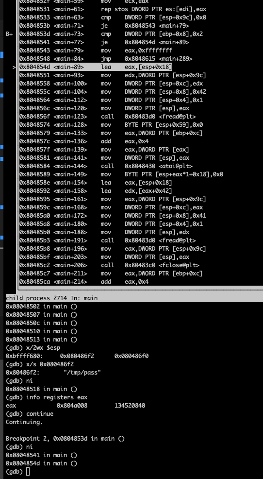
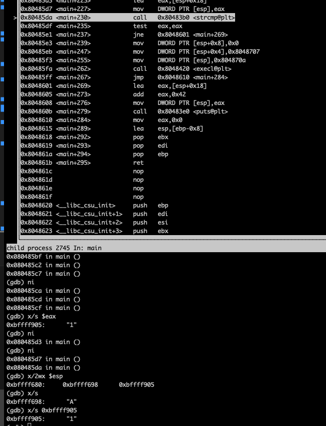

### Bonus3

#### Basic Recon


we see that there's *fopen* to the file "/home/user/end/.pass" so we may not need to inject something.
and there's call to *execl* that's also possible

#### Debug
since I don't think that there's shell injection I will not focus that much on the stack, here's how
I start gdb like this *gdb --args ./bonus3 1 2*


skipping that stack allocation I see that we are going to call *fopen*


```c
fopen("/home/user/end/.pass", "r");
```

well In gdb I don't have the access rights to open this file so I'm going to overwrite that location
to point to file path in tmp directory 
- first create file in /tmp folder
- second in gdb make change the stored data to newly created file


now as you can see that *fopen* returns non-null value which means it was successful 

at *main+36*
```s
mov DWORD PTR [esp+0x9c], eax ; we stored file pointer
lea ebx, [esp+0x18]; pointer into the stack
mov eax, 0x0
mov edx, 0x21
mov edi, ebx ; pointer in the current stack frame
mov ecx, edx ;ecx=0x21
```

#### Until Now
- [esp+0x9c] holds the value of file pointer
- edi ; pointer in the current stack frame *esp+0x18*
- ecx = 0x21
- eax = 0x0

now let's see what the following instruction
```s
rep stos DWORD PTR es:[edi], eax
```

so what should happen is the stack at location *edi* filled with 0x0=eax, 0x21=33d
**Before**


**After**


and now you see that compare at *main+63* it checks whether *fopen* was successful or not in our
case it's


now we have another compare at *main+73* it checks *argc* of main against 0x2 so I need to run
gdb like this *gdb --args ./bonus3 1*



now we are at *main+89*
```s
lea eax, [esp+0x18]; pointer in the current stack frame which was filled by zeros before
mov edx, DWORD PTR [esp+0x9c]; edx now holds file pointer
```


after that we are going to call *fread*
```c
fread(
    eax, // pointer in the current stack frame
    0x1
    0x42,
    edx // file pointer
);
```

from this you can see that *fread* will read 0x42*0x1 and store it in location pointed to by eax
**Before**


**After**


let's continue *main+128*
```s
mov BYTE PTR [esp+0x59], 0x0; why ? I have no idea yet
```

after that we call *atoi* with our input


finally we have something that can be touched by our input, what can you do with it?
```s
mov BYTE PTR [esp+eax*1+0x18], 0x0
```
in this case eax=1 that means the instruction look like this
```s
mov BYTE PTR [esp+1+0x18], 0x0
```

remember that *esp+0x18* this location has the string written by *fopen* before so by playing with
eax, **I can terminate string where I want**, how is this useful? well no idea but just keep it in mind

let's continue *main+154*


```s
lea eax, [esp+0x18]
lea edx, [eax+0x42]
```
#### Until Now
- eax: point to the start of the string
- edx: point to the end of the string
I'm just going to put enough data in the file /tmp/pass so I can see exactly what edx points to
is `\0` or last character


so from the picture you can see that *edx* points to `\0`

let's continue *main+161*
```c
fread(
    edx, // pointer in the stack right after the first string
    0x1,
    0x41,
    eax, // file pointer
);
```


and you can see also that we are done with the file we just close it at *main+196*

let's continue *main+211*


you can see that we are preparing for *strcmp* if it is successful we are going to execute *execl*
which is great but I'm not controlling the strings that are being passed to *strcmp*, but
keep in mind I can terminate the first string whenever I want maybe I'm going to use that!!



somehow these strings should be equal, where the string that now contains "A" it's part of pass
file, and the other one (contains "1") mine, how can be equal I'don't know the other one ("A")
but I can control where it will end, I can input "0" and that would force the string to be "", but
that would not work either because "" and "0" are not the same but hold on if I input "", atoi
will return 0, and I'll have both of them empty "","" okay let me try it


##### Password of end
```
3321b6f81659f9a71c76616f606e4b50189cecfea611393d5d649f75e157353c
```


