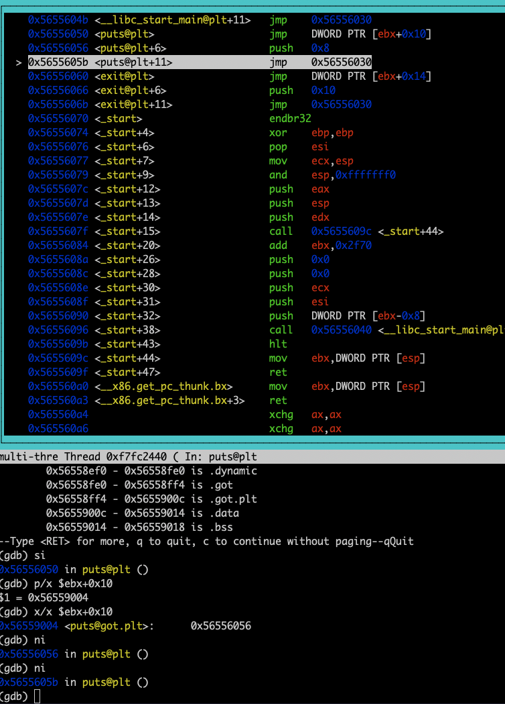

#### plt/got

have you ever wanderd how does my program where is the location of the printf that I'm calling in my
c file

```c
int main(void) {
    printf("something....\n");
}
```

well that's where the daynamic linker/loader comes in into the picture, well as you know there's static linked executables and daynamiclly linked executables


for static one it's easy because the code of puts is embedded into our output (main executable), but what about daynamic one, well there's some inderctions that will solve this problem for us, let's take look into the binary of the daynamic one.


well now let's see what is going to happen here, and I'l explain as we go, but first keep an eye on those sections
`.plt, .got, .got.plt`


let's step into the puts function


as you can see the current instruction is at `0x56556050`, that means that we jumped from the `.text` section to `.plt` section,

#### Plt section
>this section is holding a list/array of stubs/small functions, that we'll check other section that contain table as we will see later, if that table has the address of the real puts, that's great we jump to it, and if not it'll be resolved, and stored in that table if we need later (another call) and jump to it.

```asm
    jmp DWORD PTR [ebx+0x10]
```


as you can see that value is pointing into another section `.got.plt`

#### .got.plt section
>this section maybe will hold the address of the real puts


as you can see the value there is just pointing to the next instruction and that's because for the first time that table, have no idea where the locaiton of the real puts

Let's cantinue



well as you can see this jump will just take us to the start of `.plt` section


after following the jmp


now this good because now the daynamic loader will somehow find the value of the real puts, and put it in the table, to be used for later calls

remember this picture,


now the daynmaic loader should fill this location with the address of `puts`

here's before the loader does it's job


remeber the value that is stored at that location


how does the loader figure's that out well I have no idea, and I do not need to at least for now, but how do you know that's the location of puts


#### questions

but how does the process knows where to find the  loader? no idea and not needed