### Level 1


#### Basic Recon
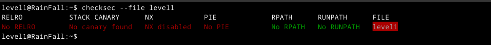

as you can see all relocation read-only is disabled, stack canary is disable, NX also, to me it seems maybe there's stack
overflow

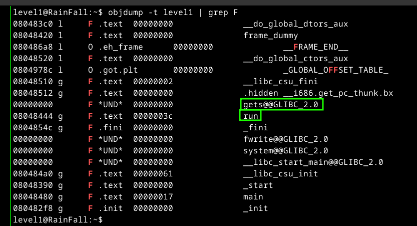

well there's call to gets, which is good, but even if there's gets is there, and we could jump to some place, a place? well run is intersting to me, we could check that

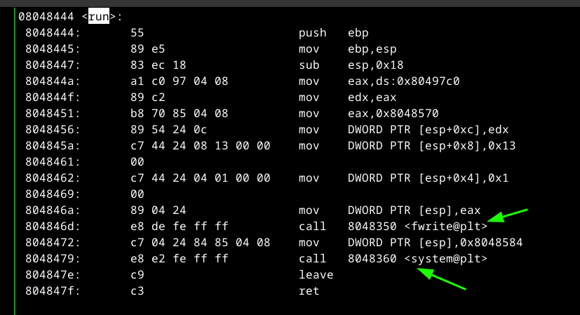

here's another good sign there's call to system, which may give us a shell let's try it

let's check in gdb

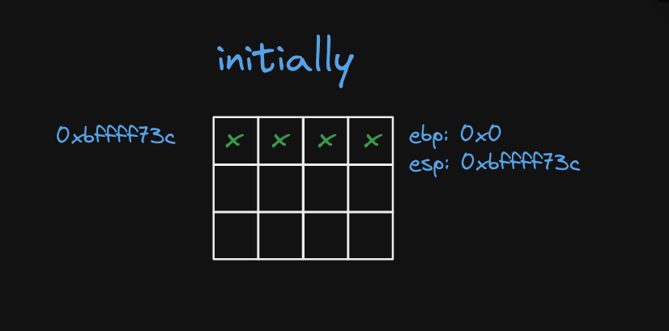
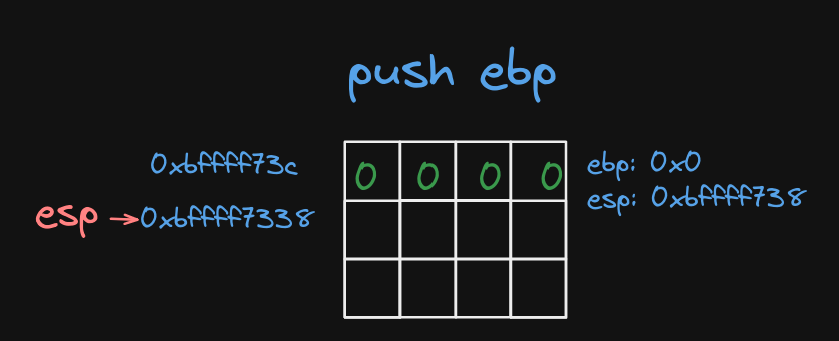

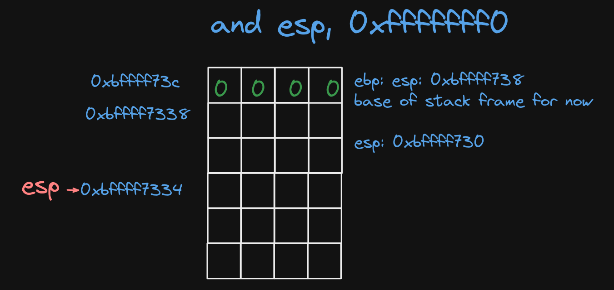
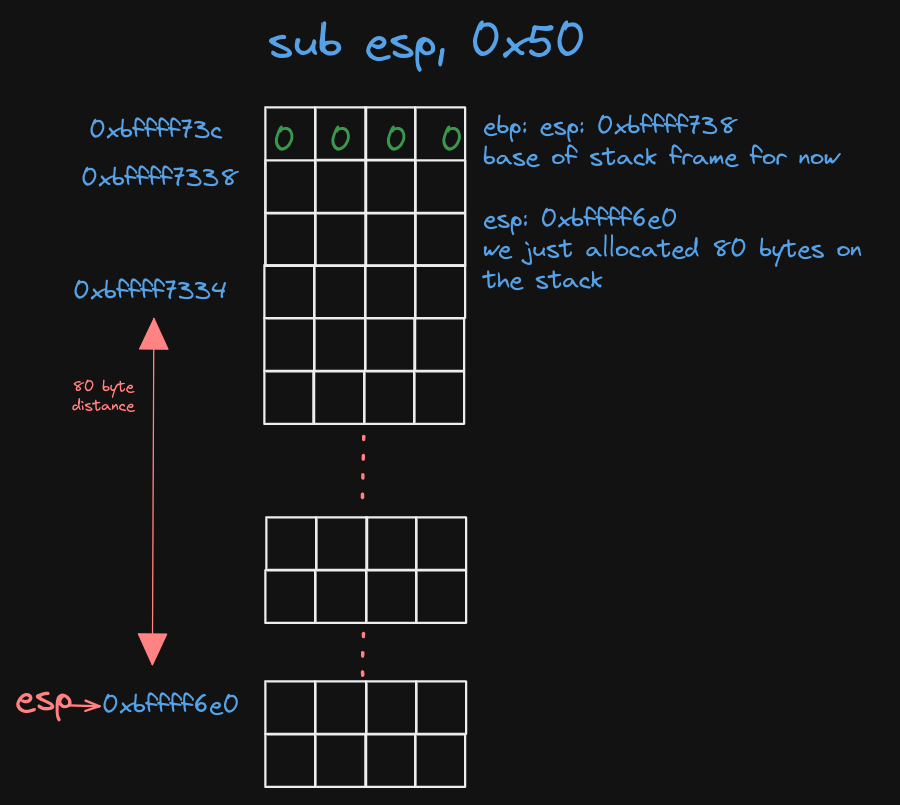
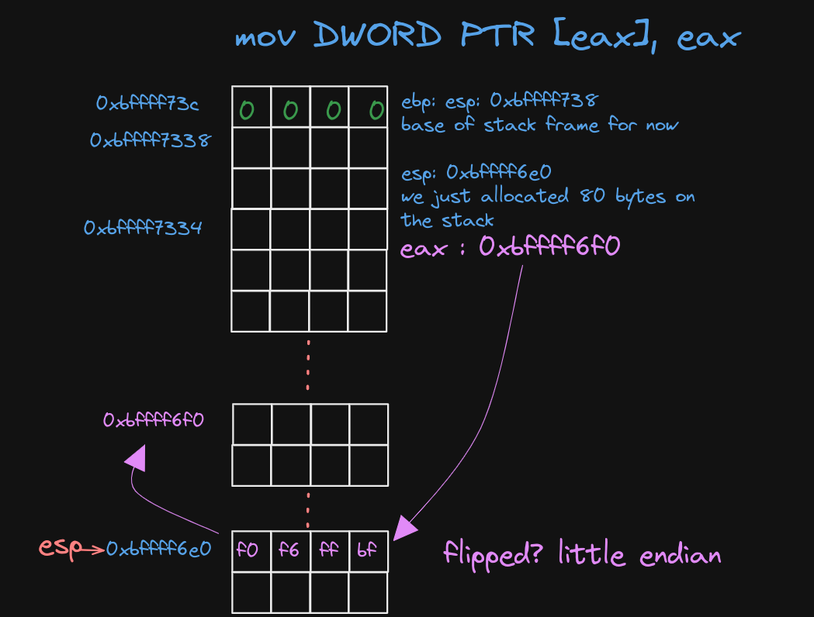

well at the top of the stack there's location that points to
another location in the stack,
so when gets get called it will use the value on the top of
the stack as pointer and write to it what we input, and now
the availbe size is 0x50 - 0x10 + 0x8 = 0x44 = 72 why, well - 0x10 because
of the pointer that will be used by gets is esp+0x10, and why add 0x8 because that allocated when we did that and operation.

so what should we now, easy we just fill the stack with 68 bytes of junk, and fill the other 4 bytes, that was occupiad by the old ebp value and after that we put the address of the run function? why well by convition the ret instruction will just pop and what is stored there it will jump to it but we are far way pop would take the wrong value well no that's becaue
of the leave instruction that will clear the current stack
frame like this

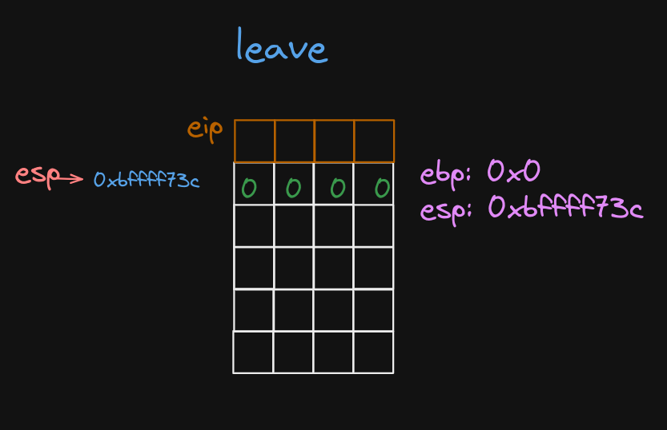

leave just copies the value of ebp to esp, and pop from there
to recover the old ebp

#### Payload
```
python -c print('B'*76 + '\x08\x04\x84\x44'[::-1])
```

why `[::-1]` just to reverse the chars

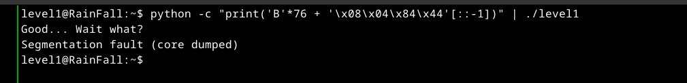

oh no segemantion fault let's see what is going in gdb

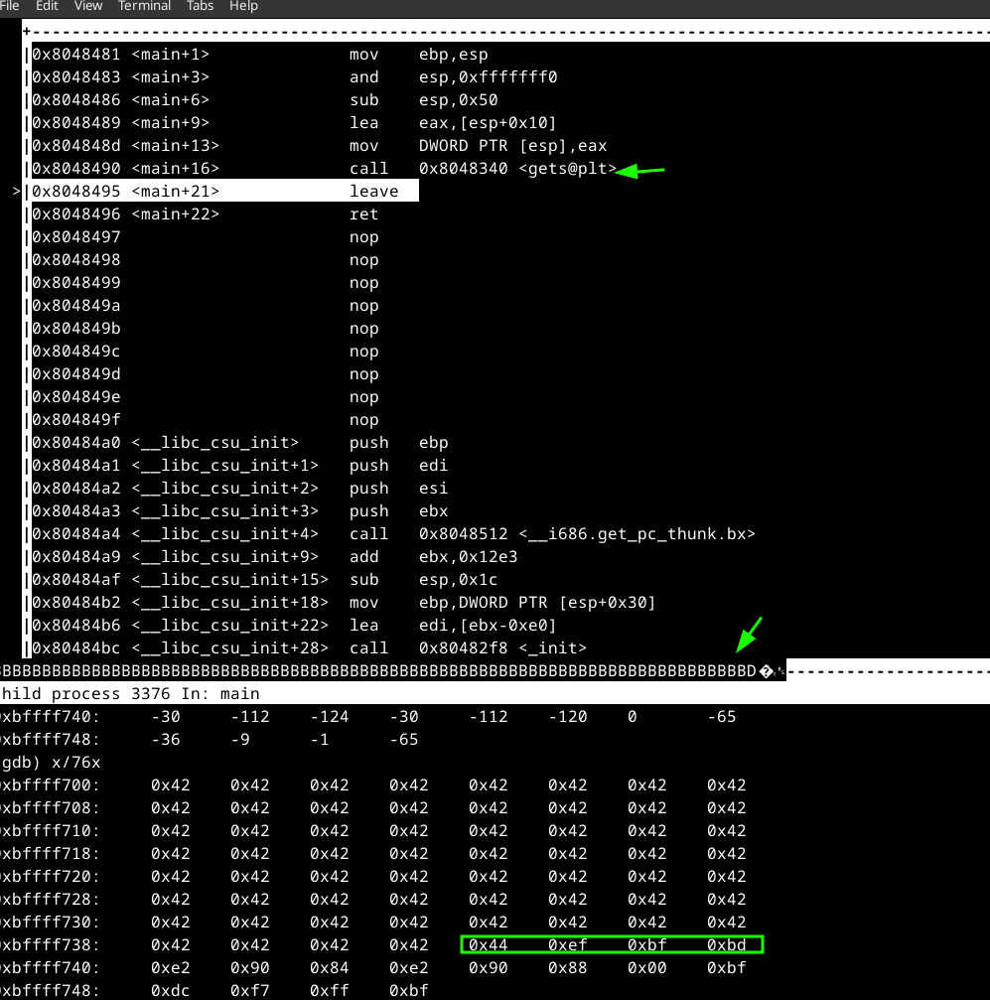

well something weird here because I expected the address of run should after that 0x42 which is ascii for B, maybe that normal copy is not good, let's try to read from file inside gdb

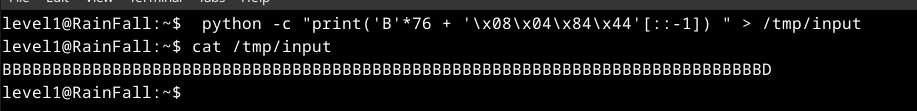
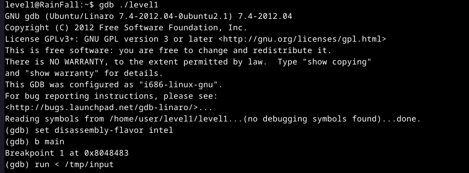
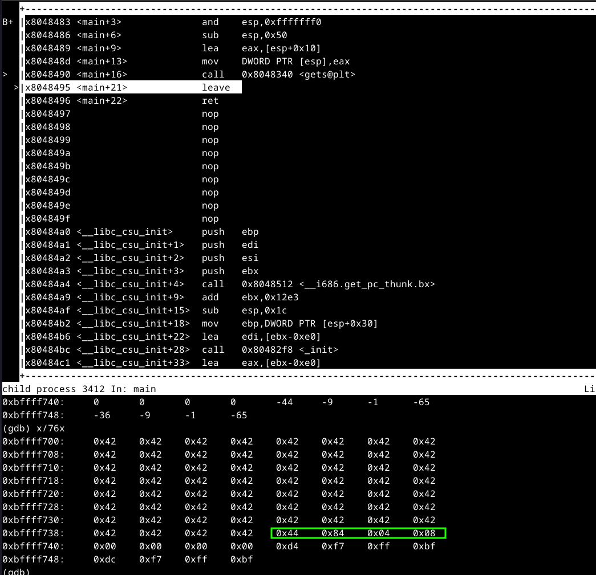
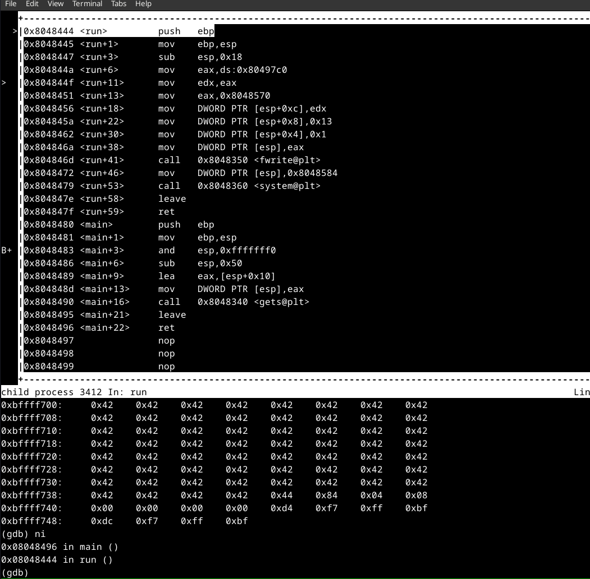

as you can see now we jumped to run

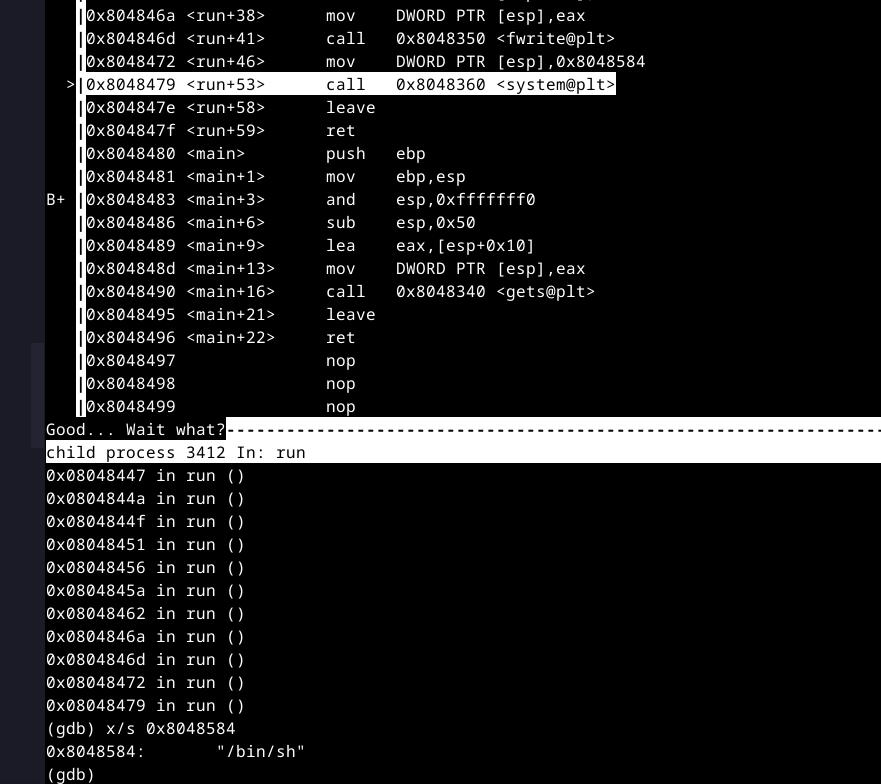

as you can see there's call to system with `/bin/sh` which is greate now

so now why how can I read before that segfault, well what is happning now is that we jump to run there's the call to system, and after ret to some random place that causes the segfault, what we could do is provide the payload and hold stdin so sh that was created by system is stuck and then we
do what we want

```
cat /tmp/input - | ./level1
```

what we are doing here is providing the payload to gets function, and hold stdin for

#### Password For level2

```
53a4a712787f40ec66c3c26c1f4b164dcad5552b038bb0addd69bf5bf6fa8e77
```
