### Level 2

#### Basic Recon
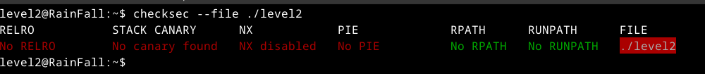
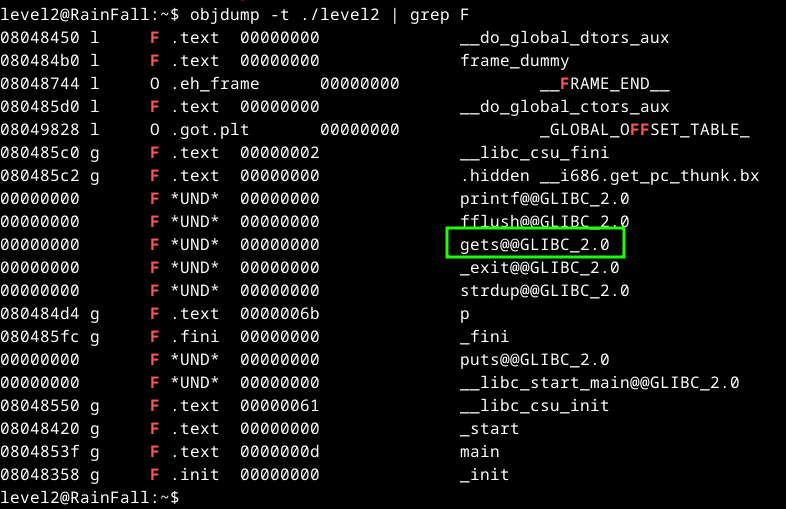

seems perfect for buffer overflow, the problem jump to where, so maybe we should insert some shell code and jump to it.

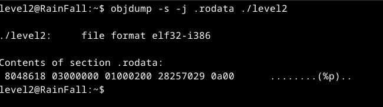

I was looking around, and I encounter this maybe it'll be useful later, usually I want to see also what strings in the file too, but I can not why? no idea

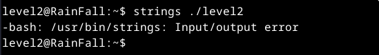

let's see what is going on in gdb

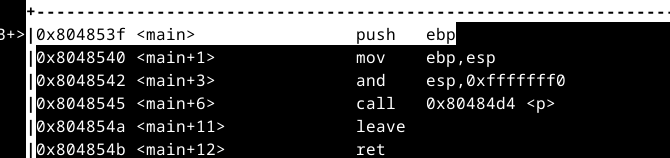

well there's call to `p`

let's see step by step what is going on here.
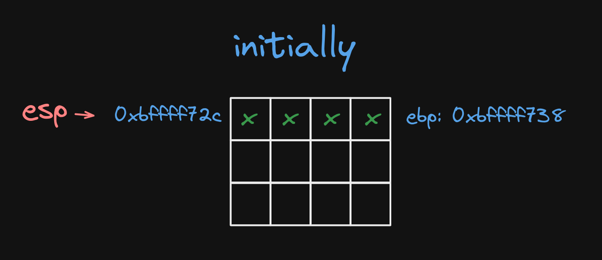
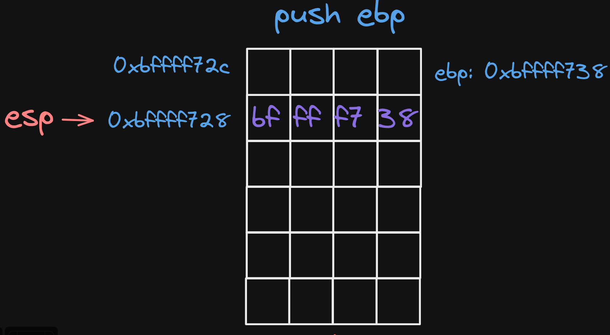
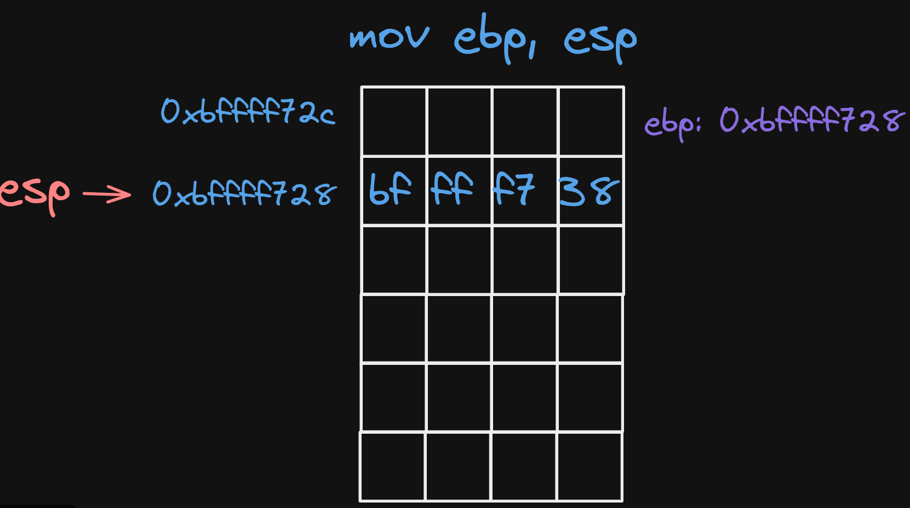
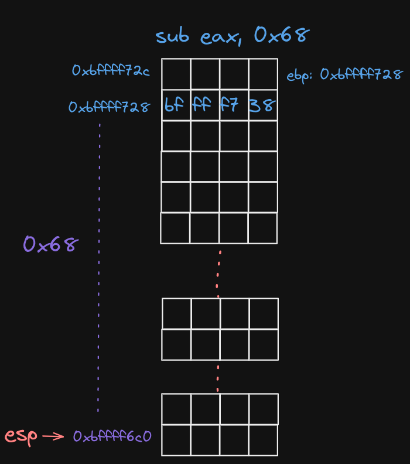

and there's call to `fflush` since the return is zero, I'll just ignore it for now

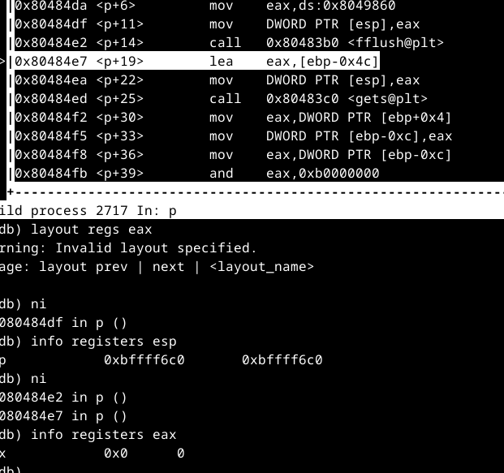
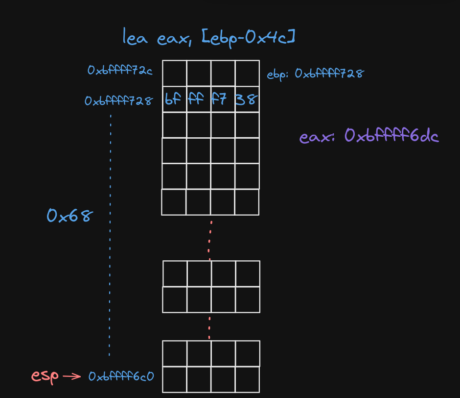
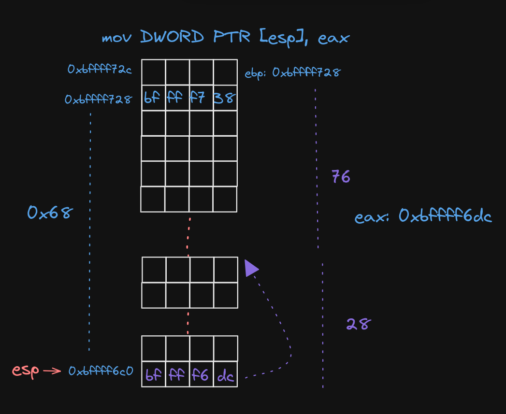

well get's can start filling from that pointer up, so we have 76 bytes before we start overwriting stuff on the stack

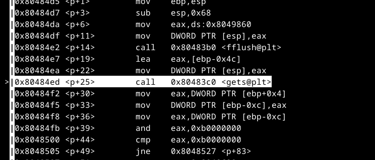

what is going after the call to `gets`,
well we are taking what is stored at location `ebp+0x4` which is usually where the parameters for the functions stored, but there were no args pass weird !!,
and after that he move that value into location in the current stack frame `ebp-0xc`
and after that there's bitwise and with the value 0xb0000000
and then there's compare oh I got it so we need to everflow that location `ebp+0x4` and fill it with 0xb0000000,
so the

```asm
    cmp eax, 0xb0000000
```

is success

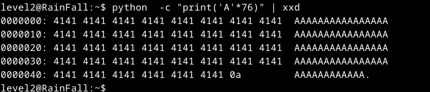
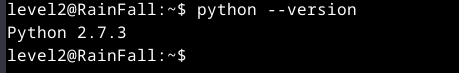
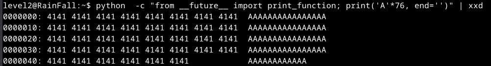

remove that annoying 0a at the end

#### Test Payload

```
python -c "from __future__ import print_function; print('A'*76, end='')"
```

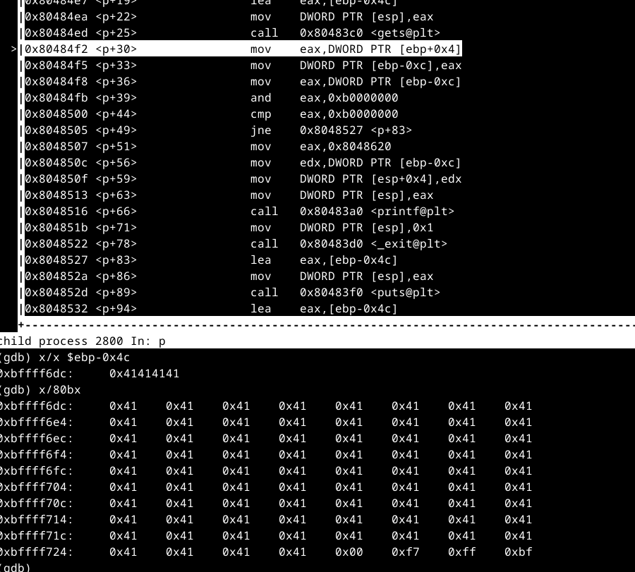

so all we need now is to add other 4 to override where the previous ebp was stored and other 4 with the value 0xb0000000

#### Test Payload

```
python -c "from __future__ import print_function; print('A'*80 + '\x00\x00\x00\xb0', end='')"
```

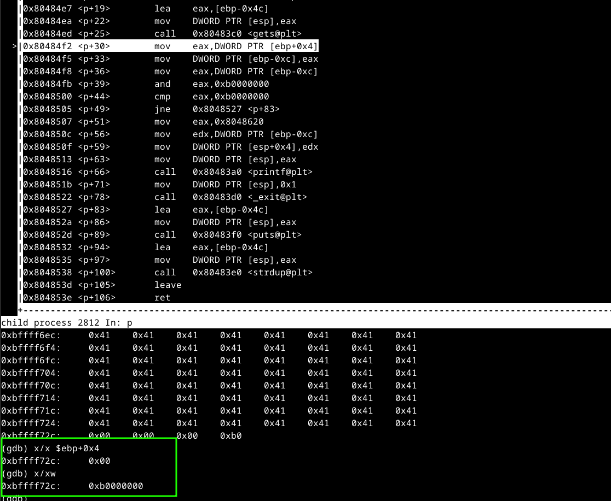

let's move on to the `cmp` instruction

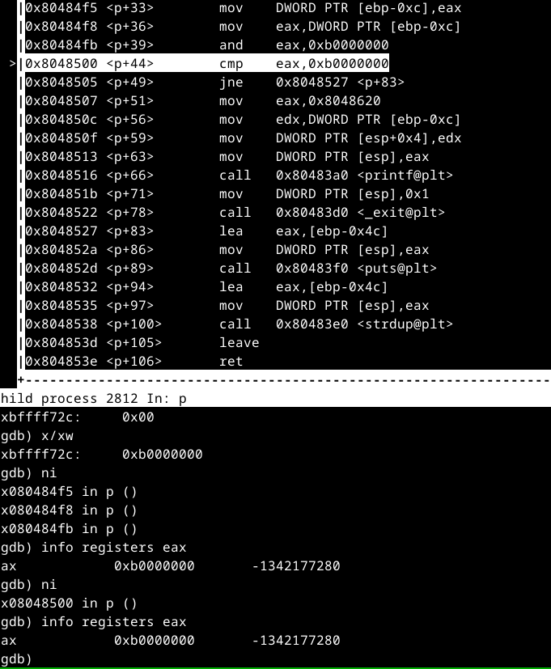

as you can see the value of eax is good now

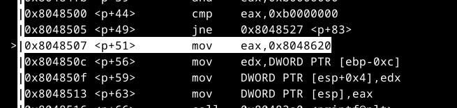

now we pass the first cmp

#### What Now?
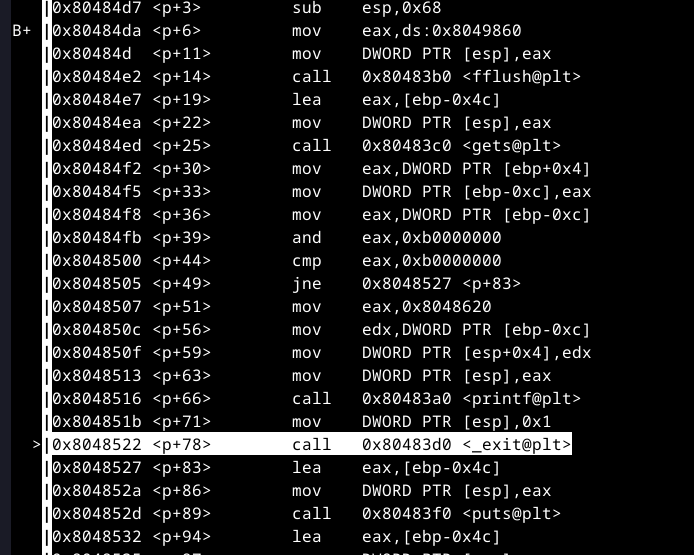

well at first I was thinkig of maybe shell code, but in order for that to work, ret instruction, should be excuted, but as you can see that's not possible because of that exit, so the exploit should happen before we reach the end of the function,

so what's the failure points between the first instruction of the function `p` to where's the call to `exit`, well after a bit of search I found out that there's somethig in `printf` called **format string attack** but that works only of `printf` is called with `%p` argument, well let's see what are printf inputs in this case,

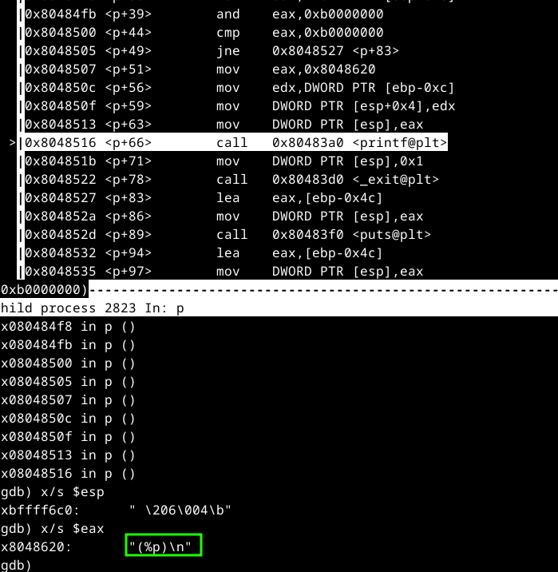

well that's the case here, that's great

let's get back but why do we choose this path maybe the other branch is better, because what is beign passted to printf is controlled I can not change it


### Stopped at this
```
```
python -c "from __future__ import print_function; print('A'*80 + '\x00\x00\x00\xb0', end='')"
```
```

I  should check the other path the strdup way