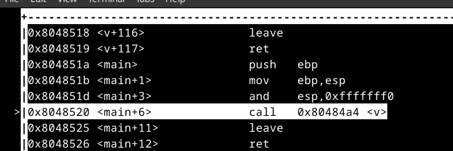
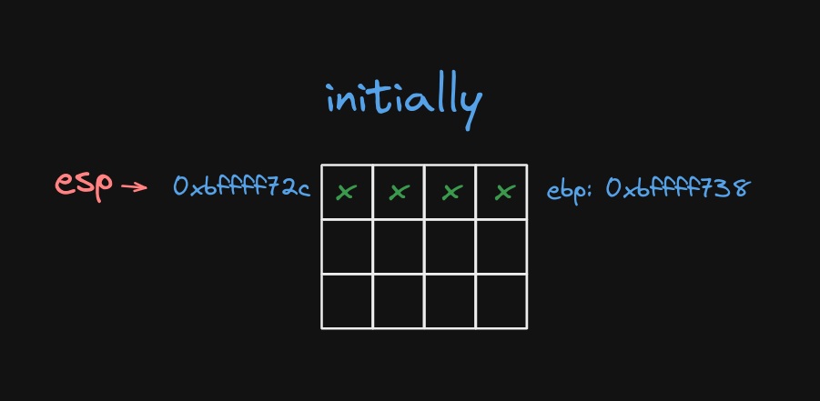
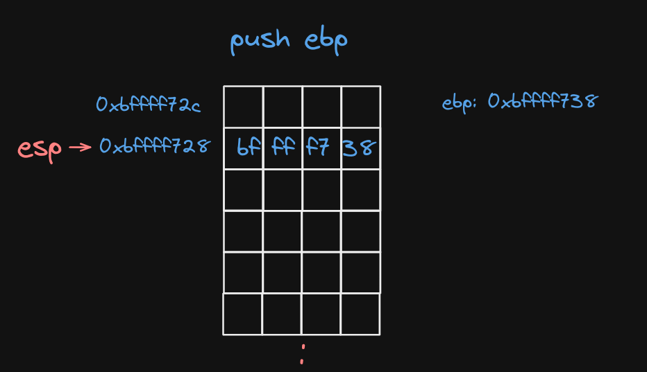
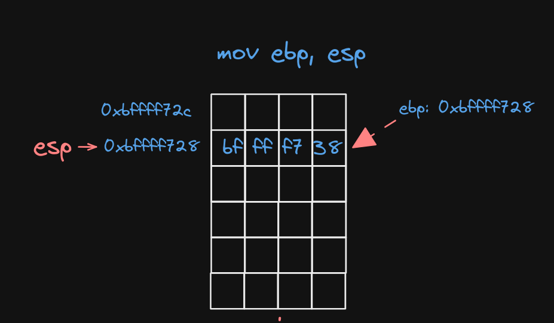
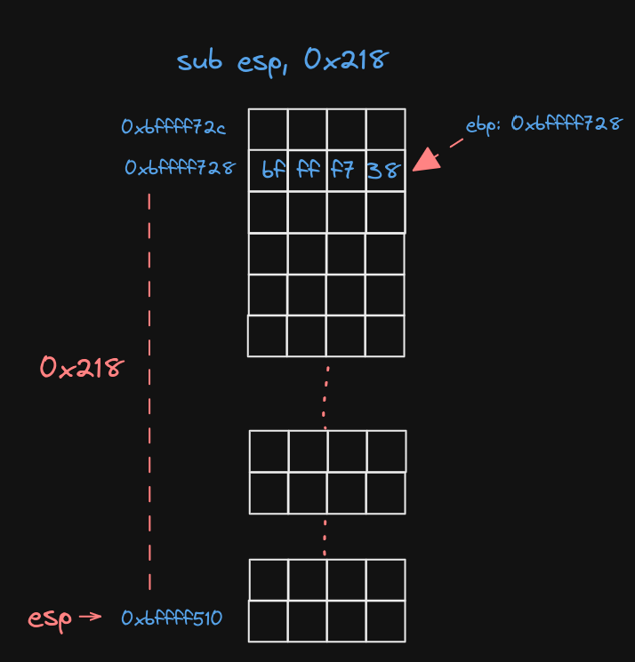
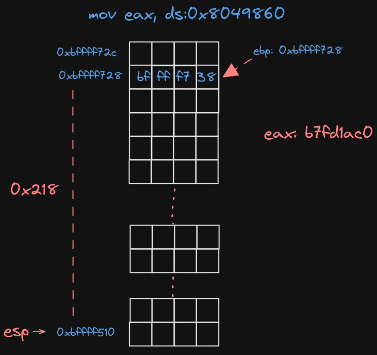
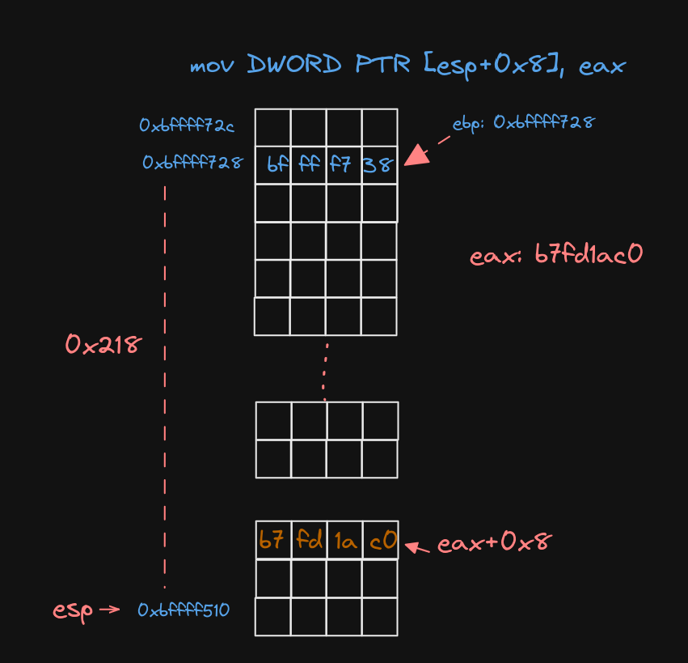
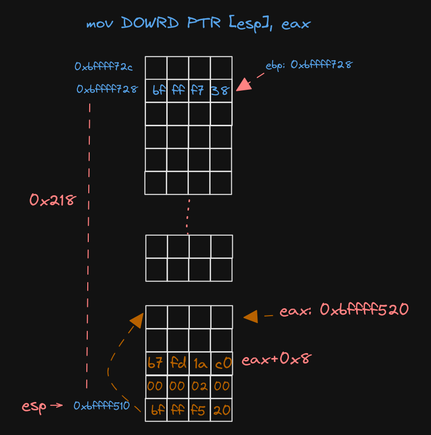
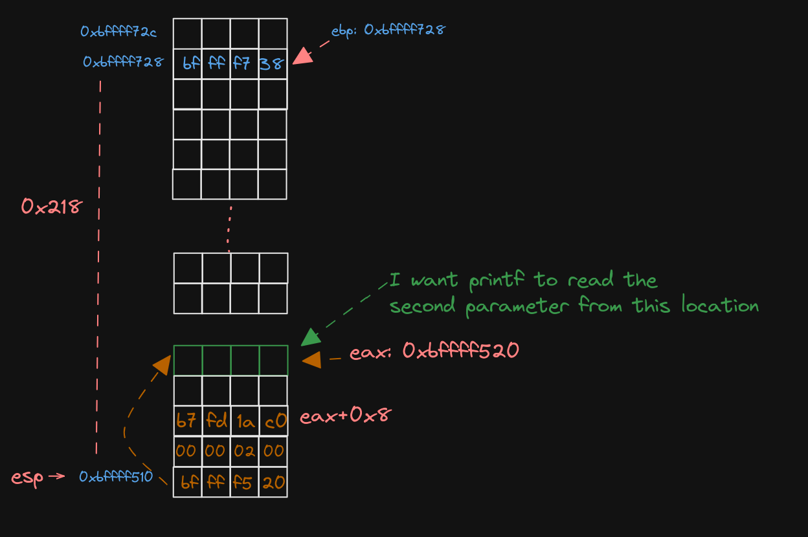

### Level 3

### Basic Recon


there's no call to gets but there's call to printf, and theres a function called v!, maybe that's the target



well v is not the target because it's the that is beign called by default


as you can see of somehow we could make eax=0x40, we would avoid that `jne` and we would reach `system` function


we somehow we need to write the value `0x40` in the location `ds:0x804988c` well luckily that printf with %n modifier, it writes the number of printed characters in that location


```c
#include <stdio.h>

int main()
{
    int a;

    printf("aaaa%n\n", &a);

    printf ("%d\n", a);
}

```


this is what I mean by `%n` modifier











so there's room for 0xbffff728-0xbffff520=510 bytes

what we want is somehow to tell printf to use address 0x804988c, but how?



so what I should do is to put the address in that green row, well that's easy because that's what fgets is doing in this case, but how do we make `printf` to read from there
well easy

"\x8c\x98\x04\x08%d%d%d.....%n"

why this format, well that three of %d well pop three 4 bytes from the stack so the next %n will read from the fourth row that is where I have put the address

and that ...... is 64-7=57 why these numbers well 64 is just 0x40 that is beign compared to eax, 7 ? well 4 for the address and 3 of %d's

I tried this but there's problem that is easier to avoid since %n, is putting what was printed ant what was passed

printf("\x8c\x98\x04\x08%d%d%d" would result for string of length ? 8c980408 first number, second number, third number

and that first, second and third I do not know their length is there other way well there's something in printf called `positional specifier` which means that I can tell that `printf` I want nth variable, so I could do something like this

```
"\x8c\x98\x04\x08.....%4$n"
```

but now .... shall be 60=64-4

```py
python -c from __future__ import print_function; print('\x8c\x98\x04\x08' + 'A'*60 + '%4\$n', end='')
```

### Password for level 4

```
b209ea91ad69ef36f2cf0fcbbc24c739fd10464cf545b20bea8572ebdc3c36fa
```
