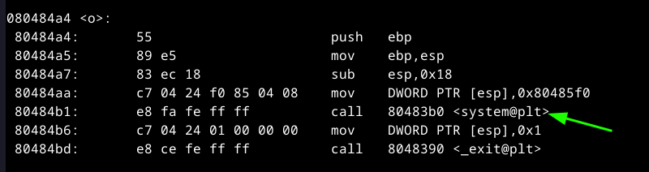

### Level 5

#### Basic Recon

it seems bad there's no call to `o` and we are using `fgets` so no overflow is possible, and even if possible we can not do it because we are exiting before we reach `ret` instruction,

well now you can see that we can do some tricks maybe if we filled that table with fake addresses like maybe the address of exit start to point to system directly!