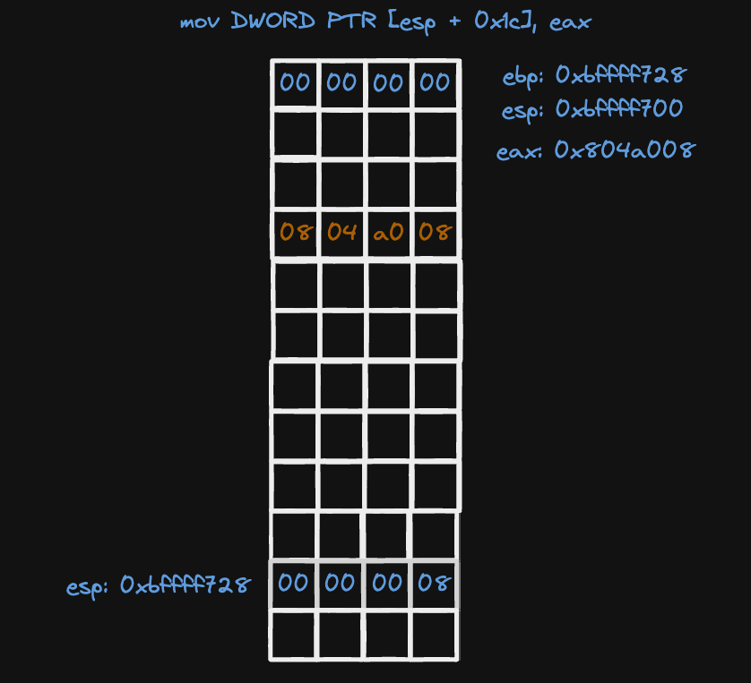
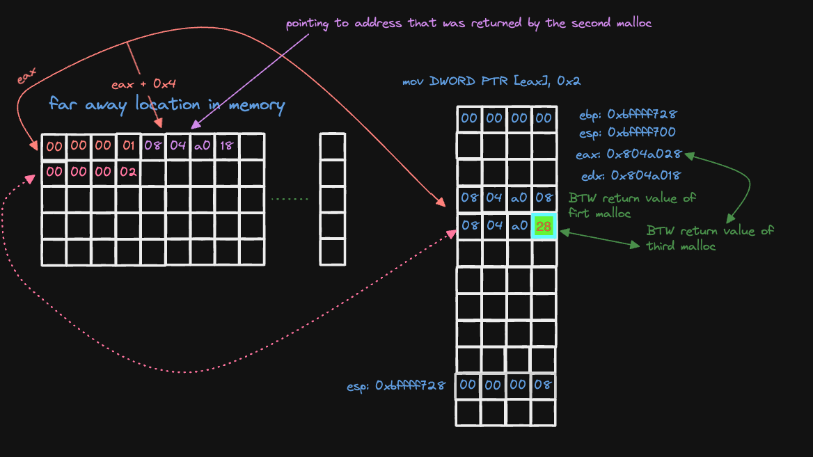
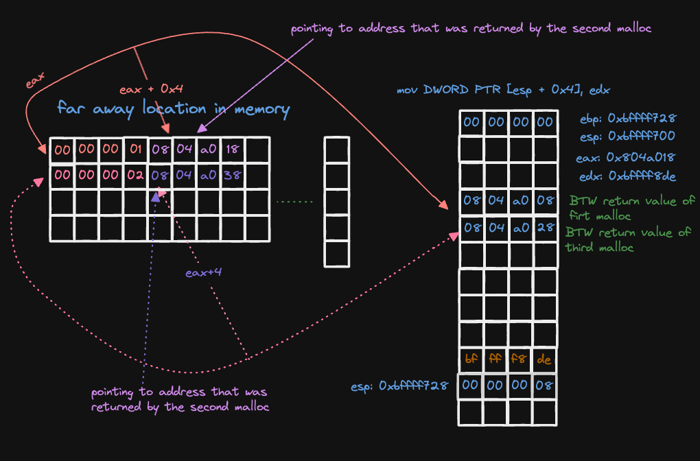

### Level 7

#### Basic Recon


as you can see there's call to `printf` maybe we are going to use it and there's some allocations
a function `m` and `fopen`?? and `strcpy` that is useful to but there's no call to system, so we might
need to insert some shell code later we'll see

let's see what is going on in the `m` function


let's debug











why 97 well that is the ascii of that character `a`


what are these values you asking well until now I see that they the parameters of `fopen`

```c
FILE *fopen(const char *path, const char *mode);
```


well fopen will need to open file of other user (level8) but since we are inside gdb that would fail


but let's assume that it will return some pointer when we are out of gdb for example 0x809867f2


so `fgets` will be called like this

```c
fgets(
    0x8049960, // store the data of the input file
    0x44, // how chars to read
    file_stream_was_return_by_fopen_of_pass_of_level_8
);
```
so somehow we need to print what was stored in `0x8049960` because that is were the password will be
saved by `fgets`


but as you can see the moment we pass that fgets we will call `puts` with `~~` as parameter, which is
of no use to me, take look at this


well we have a call to `m` that calls `printf` maybe we could change GOT so when we call `puts`
we call `printf` but how do you know that well let's see what is beign passed to printf


well as you can see from the defintion of `m` that the first parameter to printf is `%s - %d\n`,
and second parameter is `0x08049960`, oh that's where the password is stored, so yeah I'm confident
that it'll work, so let's try it

#### what do we need to do??
>instead of calling puts we shall call `m` but how?

#### Basic Recap
- malloc_1_address: `0x0804a008`
- malloc_2_address: `0x0804a018`
- malloc_3_address: `0x0804a028`
- malloc_4_address: `0x0804a038`

since our input is being copied to malloc_2_address and malloc_4_address using `strcpy`, that has no
limit check we could use that to overwrite GOT

>puts in GOT is at address `ds:0x8049928` how do I know?


so if we can override what is stored in `ds:0x8049928` to point to the address of `m` which is
`0x080484f4` we are done so now WE NEED TO OVERRIDE THE ADDRESS `0x8049928`

#### What can we override now??
for now we can override this location `0x0804a018` and `0x0804a038` but both of them are greater than
`0x8049928` so we can not override directly, what can we do? let's step back and see what is going on till this point


this the state of memory before any `strcpy` is called

##### Order Of Execution
- first `strcpy` takes it first parameter from the heap not the stack what I mean is the strcpy will take it's value from the picture
- second `strcpy` does the same hold on, we could use the first `strcpy` to change the pointer that is stored in memory to point our target `0x8049928`

so we will write `0x0804a028 - 0x0804a018 = 16` and +4 why because I want to override the second
half of that 8 bytes the half that contains `0x0804a038` before we start overriding the second memory

let's test it


memory before first `strcpy`


memory after


it worked, so now we need to put the address `0x8049928` instead of `abcd` and second parameter shall
contain `0x080484f4` address of `m`


### Exploit

```python3
./level7 $(python -c "print('A'*20 + '\x28\x99\x04\x08')") $(python -c "print('\xf4\x84\x04\x08')")
```


### Password for level8

```
5684af5cb4c8679958be4abe6373147ab52d95768e047820bf382e44fa8d8fb9
```