### Level 8

### Basic Recon


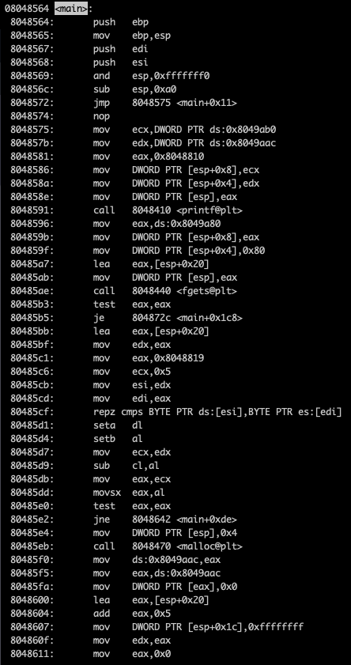

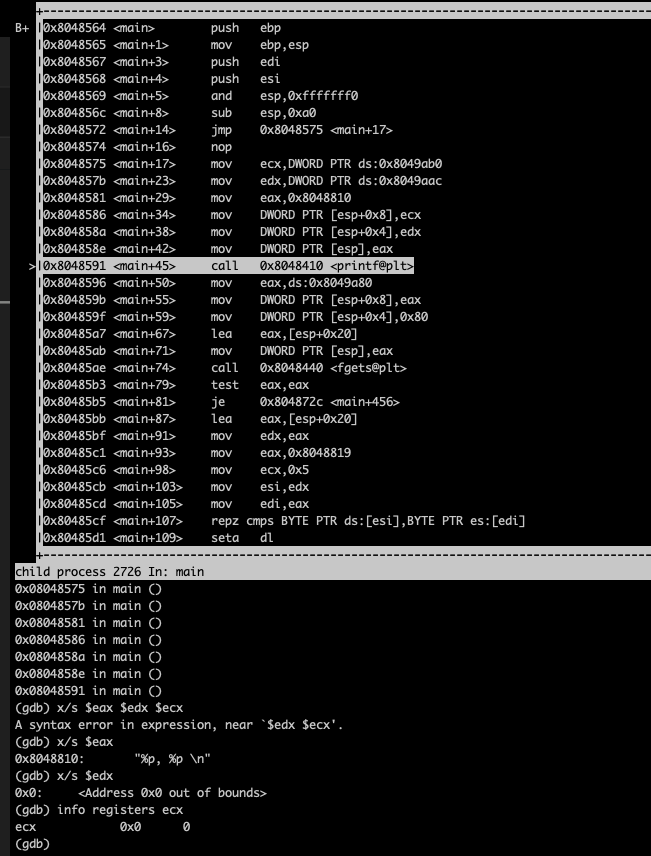


first we call printf like this
```c
printf(
    "%p, %p \n",
    0x0,
    0x0
);
```

why ? no idea!

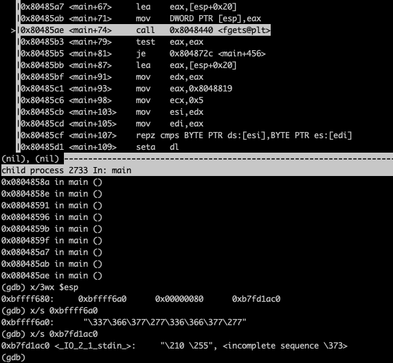

there's call to fgets
```c
fgets(
    0xbffff6a0, // dst
    0x80, // 128
    0xb7fd1ac0 // which is FSTREAM pointer, in other words our input
);
```

and by the way here's the input data


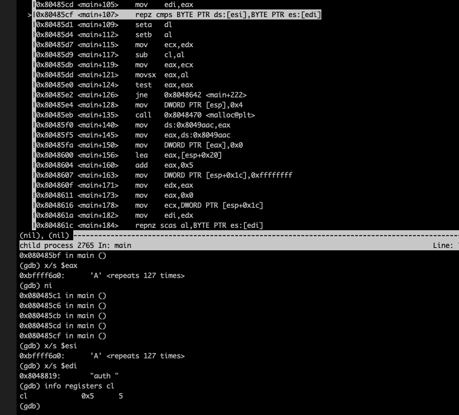

so here there's comparison that is happening between my input and the string `auth `, and if not we will
jump to `main+222` now we have the choice either to gamble that we should provide `auth ` as input, but I would like
to be sure, let's see what is going on `main+222`


so what happend now, well we got ourselves into another comparison, and we skipped call to `malloc`
and `scas` aka scan string and  and `strcpy` that is writing to this location `0x8049aac` SO WHAT? let's continue and see

but now we are facing another comparison with the value `reset` so we will jump again to another place `main+276`

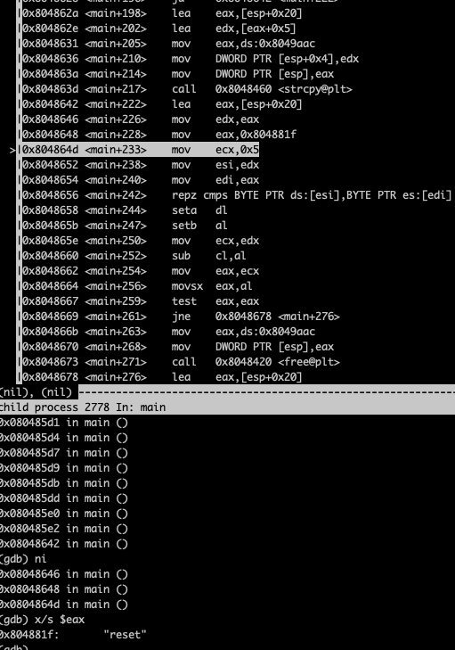

after `jne main+276`

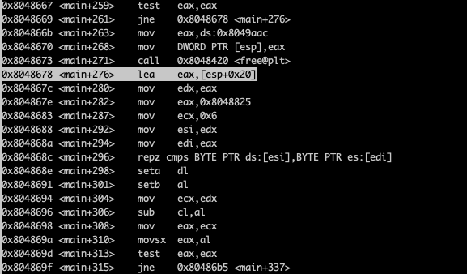

we skipped call to `free` SO WHAT? let's continue again there's another comparison with `service`
skip again!!! and I encountered another comparison with `login` skip it also for now

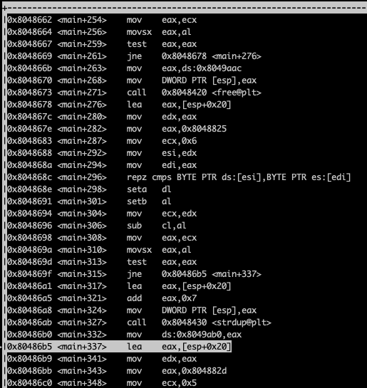

there's another one with `login`

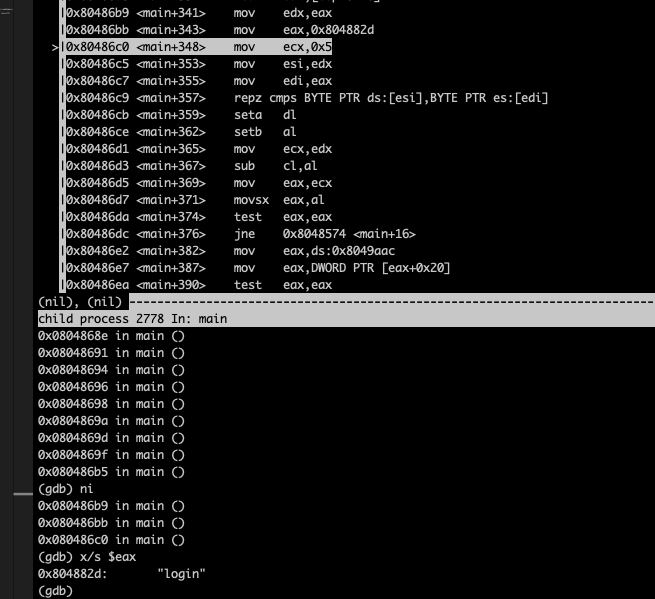

but as you can see there's that `jne main+16` that would be bad it's going to be loop we better enter
at least `login` and see

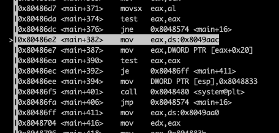

we did skip that now, are we good? well no


well that location `0x8049aac` shall contains something, wait what so it's not good idea to skip
that strcpy

here are the strings that we have compared against

`auth `: skiped malloc and strcpy
`reset`: skiped free
`service` and `login`

#### More Details

###### First Iteration

here's how the memory look like before the first call to `printf`

```c
printf (
    "%p, %p\n",
    *(0x8049aac),
    *(0x8049ab0)
);
```


and pointer to the first parameter will be in the last row of the stack in the picture

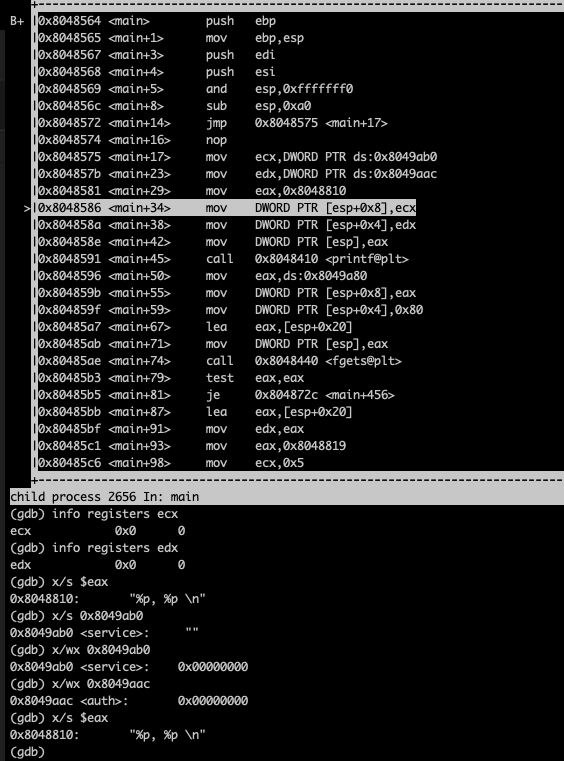

and here's how `fgets` is called

```c
fgets(
    0xbffff6a0,
    0x80,
    our_input
);
```

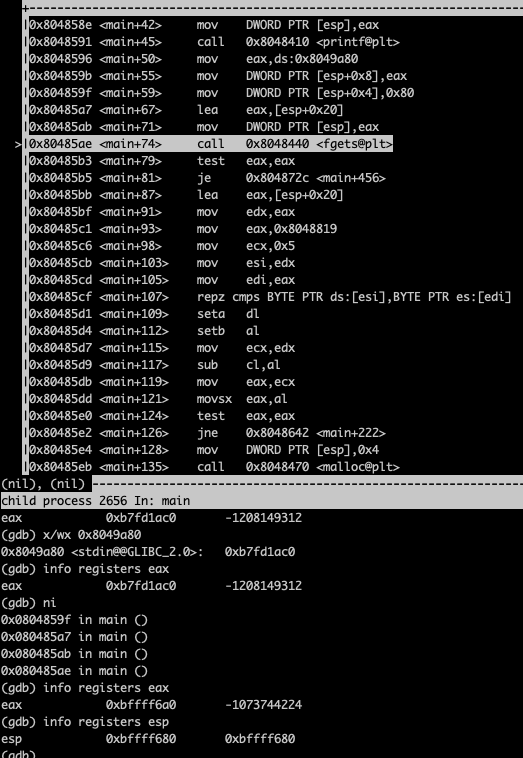
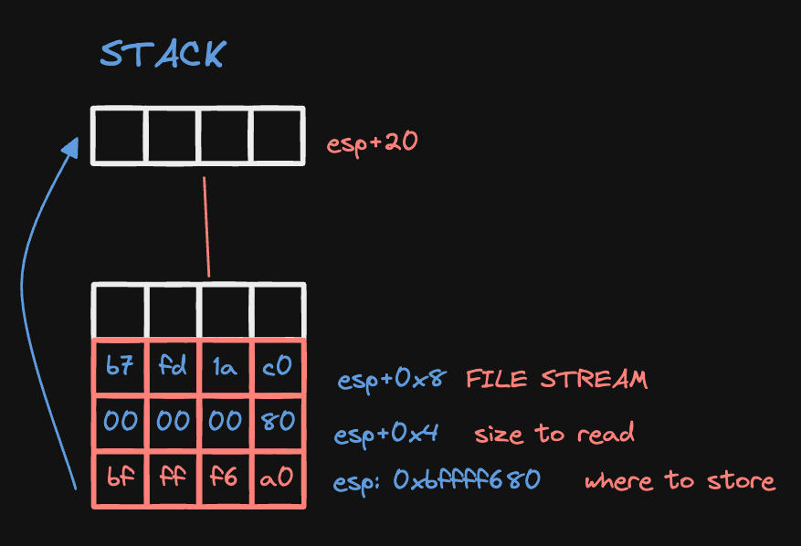

compare after `fgets`

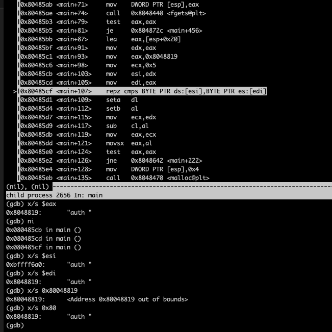

after `malloc`


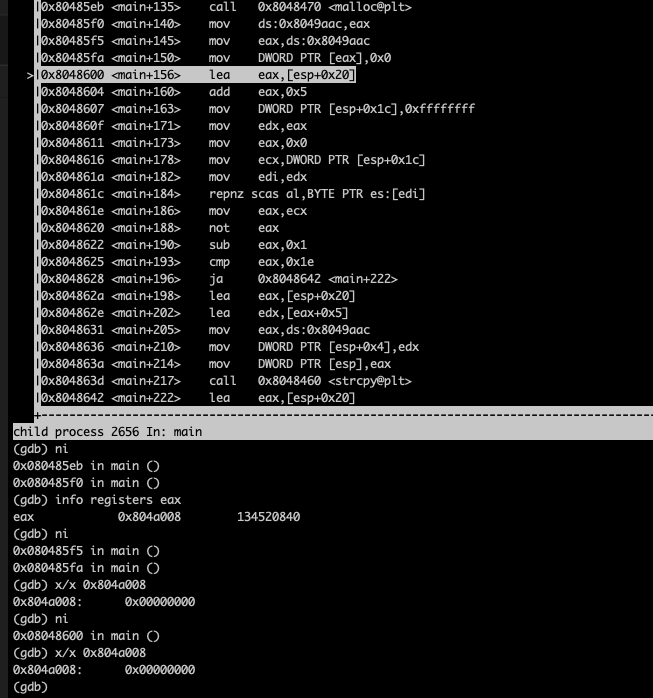

starting from `main+156`

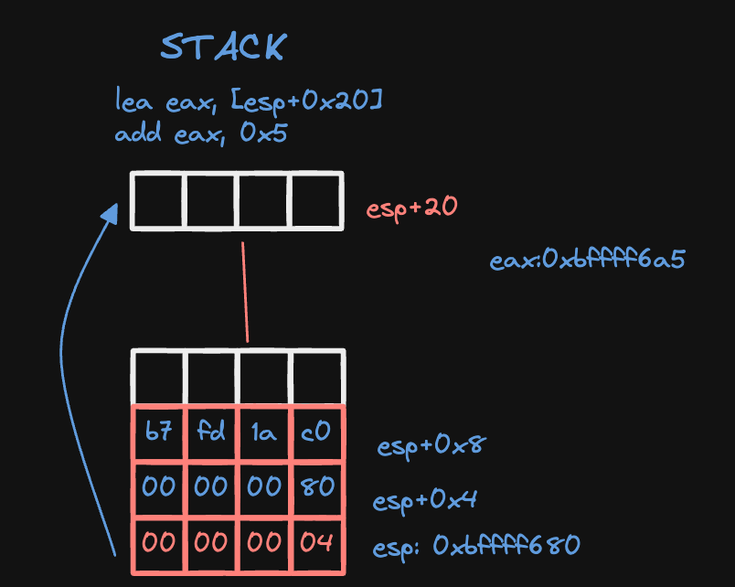
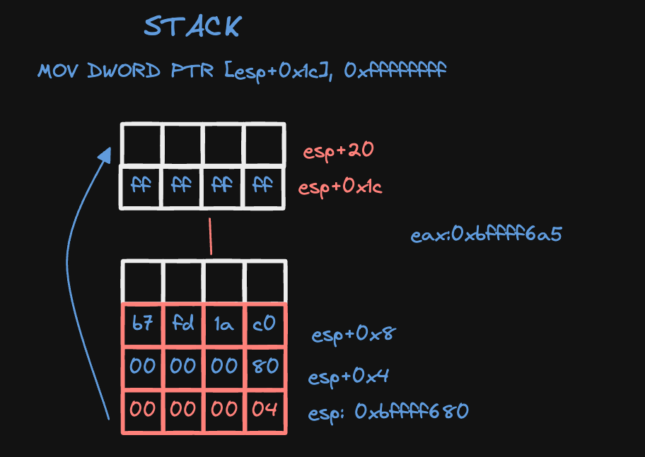
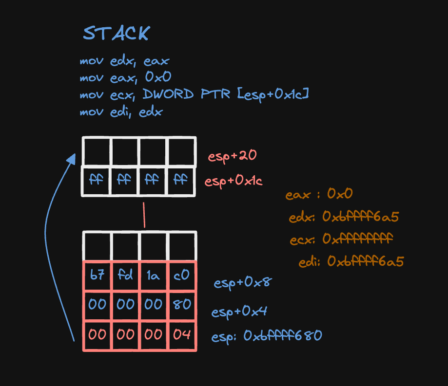


starting from `main+184` (string scan)

before `scas` instruction


after `scas` instruction


as you can see the ZF flag is sent which means that the compared values are equal so there's no jump coming

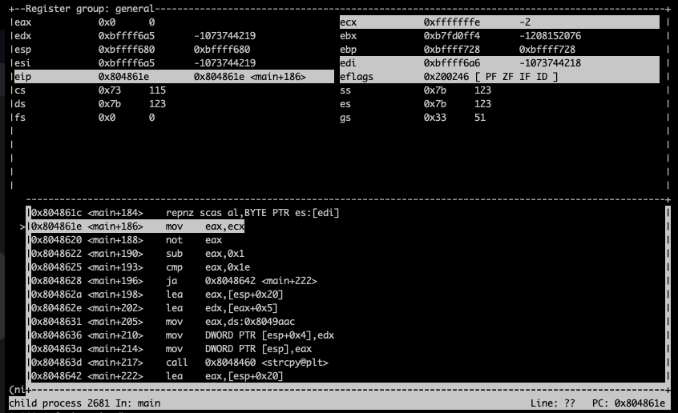


here's how `strcpy` is called

```c
strcpy(
    0x0804a008, // memory location that wax return by malloc
    0xbffff6a5, // pointing to the top of the stack
    // it's pointing at 5th of our input for example if our input were `auth abc..`
    // 0xbffff6a5 would start from `abc..`
);
```

`strcpy` will copy what was there to that memory location.

after that there's comparison with `reset` which I don't want it to be success because if it did it
will free the memory which I don't want

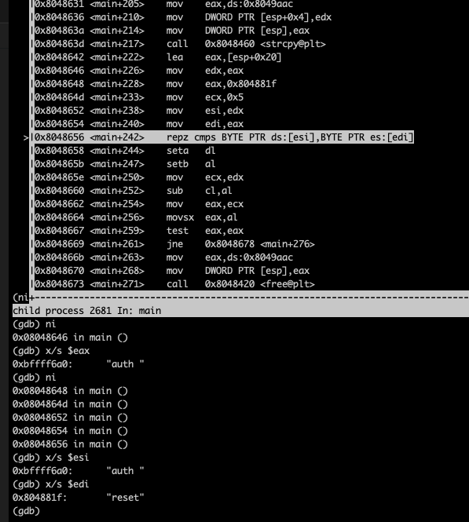

after `main+276` and yes I did skip `free`

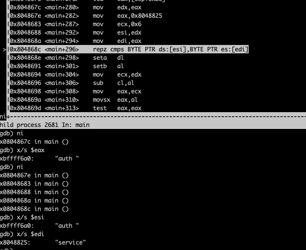

as you can see there's another compare to `service` which it will be skiped well for now at least
because the iteration that will have `service` will do strdup and strdup will copy what was after the first 7 characters from our input
for example `auth aabcd...`, `strdup` will start from `bcd..` and so on.

compare with `login`

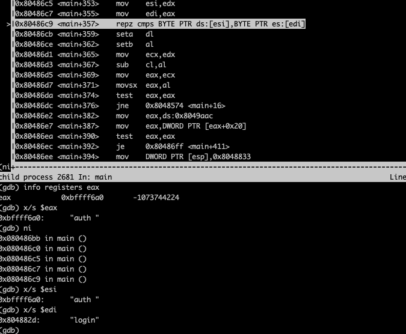


from the pic below you can see this `mov eax, DWORD PTR [eax+0x20]` should not be zero, but how would I do that
well our input is being copied to the location `eax` but that location has space of 4 because of the previous malloc(4)
but we have `strdup` if it got called with big enough input it will fill what is after that eax exactly it will start at `0x804a018`
and `eax+0x20` = `0x804a028`, so how big is big enough, `0x804a028 - 0x804a018 = 16`, so we need 16 chars after `service` like this
`serviceAAAAAAAAAAAAAAAA`


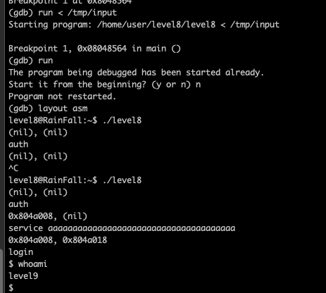


#### How To Exploit
>input these `auth `, `serviceAAAAAAAAAAAAAAAA` and `login`

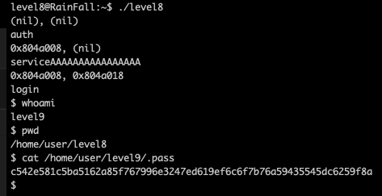

#### Password for level9
```
c542e581c5ba5162a85f767996e3247ed619ef6c6f7b76a59435545dc6259f8a
```